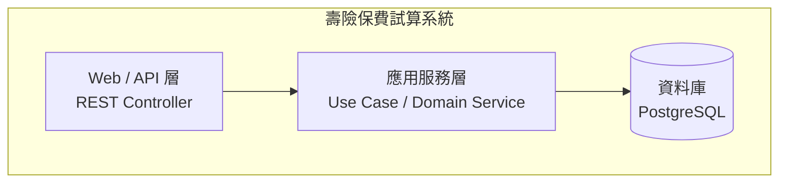
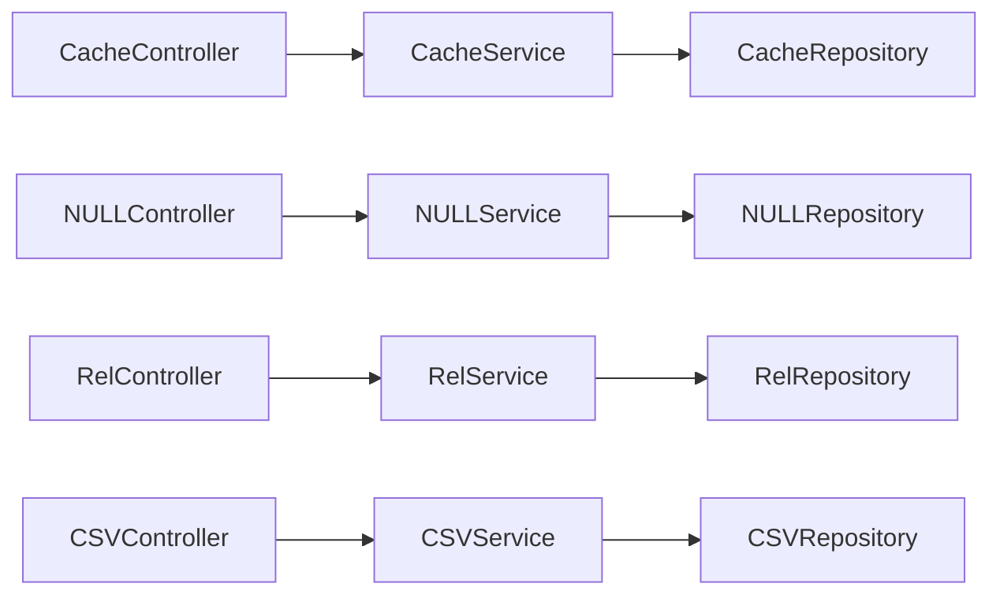
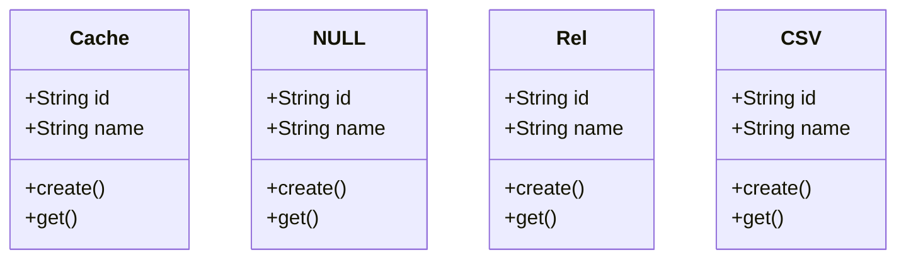
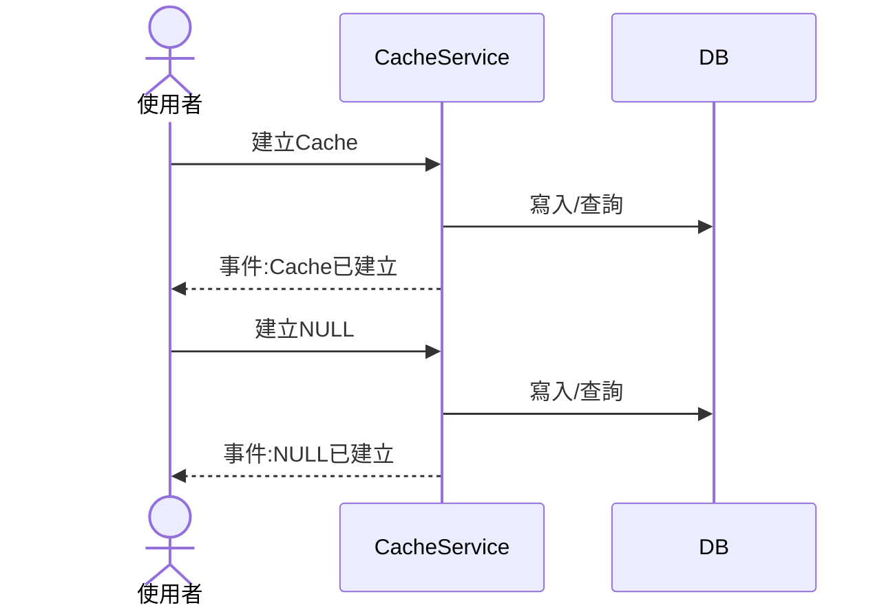
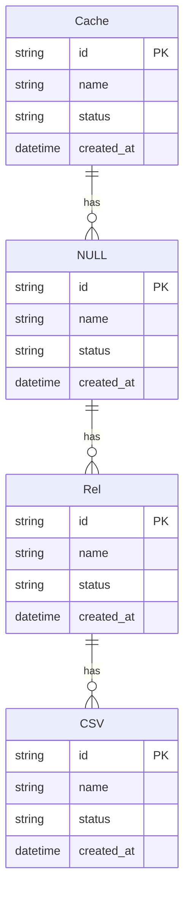

# 壽險保費試算系統

> 本文件由 SDLC Agentic Platform 於**業務需求與技術需求皆經人工確認後**自動產出/更新(application type:JAVA_BACKEND);測試案例階段確認後會再補入技術層級測試情境。

## 1. 分析方法與流程

本專案的架構文件依循以下推導鏈,每一步的產物都是下一步的輸入:


- **事件風暴**:從業務輸入(白板/看板/文件)辨識 domain event(領域中已發生的事實)、command(觸發動作)、actor、policy、外部系統,依便利貼顏色語彙分類、依空間分佈分群出 bounded context。
- **Context Mapping**:以事件流方向排出 context 間的上下游(U→D)關係,並標註與外部系統的整合點。
- **C4 / UML / ER**:由上述分析**機械式推導**——類別=aggregate、方法=command、循序=command→event(各 context 一張 + 跨 context **端對端 E2E** 一張)、狀態=事件序、ER=aggregate 與實體。

## 2. C4 Model

### L1 系統情境圖(System Context)

**說明**:系統與使用者、外部系統的邊界。


### L2 容器圖(Container)

**說明**:系統內部的可部署單元與資料流;採技術需求確認的三層式架構(Web/API → 應用服務 → 資料庫),外部系統經應用服務層整合。



### L3 元件圖(Component)

**說明**:以實體為單位的 Controller/Service/Repository 元件。



## 3. UML

### 類別圖(Class Diagram)

**說明**:以實體為骨架的類別。



### 循序圖(Sequence Diagram)

**說明**:由事件風暴的 command→event 流逐一還原——actor 發出 command,服務落地後回應 domain event;🟪 policy 以備註標在對應服務上。各 context 一張,最後附**跨 context 的端對端 E2E 圖**。



## 4. ER Diagram

**說明**:每個 aggregate 一張資料表(id/name/status/created_at 為通用欄位,細部欄位由開發階段依技術需求補齊);關聯依事件流方向建立。



## 5. 測試案例

**說明**:業務層級 Gherkin 出自業務需求文件,是驗收的**最高權威來源**;技術層級情境由測試案例階段從業務 Gherkin 展開(含邊界與負向情境);各 bounded context 的驗收要點由 domain event 反推(每個事件都應可驗證)。

### 業務層級 Gherkin(權威來源)
```gherkin
Feature: 保費即時試算
  壽險業務員與訪客可輸入被保人資料，
  系統即時回傳正確保費，
  以支援業務員在客戶面談時提供精確報價。

  Background:
    Given 系統中存在商品代碼 "LIFE-2026-A" 的有效費率表
    And 費率表中 年齡 35 歲、男性、繳費年期 20 年 的費率為 12.5

  # ── 正常試算 ──────────────────────────────────────────

  Scenario: 業務員成功試算保費
    Given 業務員「王小明」已登入系統
    When 業務員輸入以下試算條件：
      | 欄位       | 值            |
      | 被保人年齡 | 35 歲         |
      | 性別       | 男            |
      | 保額       | NTD 1,000 萬元 |
      | 繳費年期   | 20 年         |
      | 商品代碼   | LIFE-2026-A   |
    Then 系統回傳試算結果：
      | 欄位       | 值              |
      | 年繳保費   | NTD 125,000 元  |
      | 月繳保費   | NTD 10,729 元   |
    And 系統保存一筆業務員「王小明」的試算成功紀錄
    And 試算紀錄包含輸入的五項參數與試算結果

  Scenario: 訪客成功執行匿名試算
    Given 使用者未登入（訪客身份）
    When 訪客輸入以下試算條件：
      | 欄位       | 值            |
      | 被保人年齡 | 35 歲         |
      | 性別       | 男            |
      | 保額       | NTD 1,000 萬元 |
      | 繳費年期   | 20 年         |
      | 商品代碼   | LIFE-2026-A   |
    Then 系統回傳試算結果：
      | 欄位       | 值              |
      | 年繳保費   | NTD 125,000 元  |
      | 月繳保費   | NTD 10,729 元   |
    And 系統不保存任何試算紀錄

  # ── 保費計算精度驗證 ──────────────────────────────────

  Scenario Outline: 保費計算精度——年繳與月繳四捨五入
    Given 費率表中 年齡 <年齡>、<性別>、繳費年期 <繳費年期> 年 的費率為 <費率>
    And 業務員已登入系統
    When 業務員輸入保額 NTD <保額>萬元、年齡 <年齡> 歲、性別 <性別>、繳費年期 <繳費年期> 年、商品代碼 "LIFE-2026-A"
    Then 系統回傳年繳保費 NTD <年繳保費> 元
    And 系統回傳月繳保費 NTD <月繳保費> 元

    Examples:
      | 年齡 | 性別 | 繳費年期 | 費率  | 保額  | 年繳保費 | 月繳保費 |
      | 35   | 男   | 20       | 12.5  | 1000  | 125000   | 10729    |
      | 40   | 女   | 10       | 15.0  | 500   | 75000    | 6444     |

  # ── 年齡邊界驗證 ──────────────────────────────────────

  Scenario: 被保人年齡為最低承保年齡（0 歲）時試算成功
    Given 業務員已登入系統
    And 費率表中存在 年齡 0 歲、男性、繳費年期 20 年 的費率
    When 業務員輸入被保人年齡 0 歲、性別 男、保額 NTD 100 萬元、繳費年期 20 年、商品代碼 "LIFE-2026-A"
    Then 系統成功回傳試算結果

  Scenario: 被保人年齡為最高承保年齡（70 歲）時試算成功
    Given 業務員已登入系統
    And 費率表中存在 年齡 70 歲、男性、繳費年期 10 年 的費率
    When 業務員輸入被保人年齡 70 歲、性別 男、保額 NTD 100 萬元、繳費年期 10 年、商品代碼 "LIFE-2026-A"
    Then 系統成功回傳試算結果

  Scenario: 被保人年齡超過最高承保年齡時試算失敗
    Given 業務員「王小明」已登入系統
    When 業務員輸入被保人年齡 71 歲、性別 男、保額 NTD 100 萬元、繳費年期 10 年、商品代碼 "LIFE-2026-A"
    Then 系統拒絕試算並回傳失敗原因「年齡超限」
    And 系統保存一筆業務員「王小明」的試算失敗紀錄，失敗原因為「年齡超限」

  Scenario: 被保人年齡低於最低承保年齡時試算失敗
    Given 業務員「王小明」已登入系統
    When 業務員輸入被保人年齡 -1 歲、性別 男、保額 NTD 100 萬元、繳費年期 10 年、商品代碼 "LIFE-2026-A"
    Then 系統拒絕試算並回傳失敗原因「年齡超限」
    And 系統保存一筆業務員「王小明」的試算失敗紀錄，失敗原因為「年齡超限」

  # ── 保額邊界驗證 ──────────────────────────────────────

  Scenario: 保額為最低保額（NTD 100 萬元）時試算成功
    Given 業務員已登入系統
    When 業務員輸入被保人年齡 35 歲、性別 男、保額 NTD 100 萬元、繳費年期 20 年、商品代碼 "LIFE-2026-A"
    Then 系統成功回傳試算結果

  Scenario: 保額為最高保額（NTD 5,000 萬元）時試算成功
    Given 業務員已登入系統
    When 業務員輸入被保人年齡 35 歲、性別 男、保額 NTD 5000 萬元、繳費年期 20 年、商品代碼 "LIFE-2026-A"
    Then 系統成功回傳試算結果

  Scenario: 保額低於最低保額時試算失敗
    Given 業務員「王小明」已登入系統
    When 業務員輸入被保人年齡 35 歲、性別 男、保額 NTD 99 萬元、繳費年期 20 年、商品代碼 "LIFE-2026-A"
    Then 系統拒絕試算並回傳失敗原因「保額超限」
    And 系統保存一筆業務員「王小明」的試算失敗紀錄，失敗原因為「保額超限」

  Scenario: 保額超過最高保額時試算失敗
    Given 業務員「王小明」已登入系統
    When 業務員輸入被保人年齡 35 歲、性別 男、保額 NTD 5001 萬元、繳費年期 20 年、商品代碼 "LIFE-2026-A"
    Then 系統拒絕試算並回傳失敗原因「保額超限」
    And 系統保存一筆業務員「王小明」的試算失敗紀錄，失敗原因為「保額超限」

  Scenario: 保額非整數萬元時試算失敗
    Given 業務員已登入系統
    When 業務員輸入保額 NTD 100.5 萬元
    Then 系統拒絕試算並回傳「保額須為整數萬元」的提示

  # ── 繳費年期驗證 ──────────────────────────────────────

  Scenario Outline: 合法繳費年期試算成功
    Given 業務員已登入系統
    When 業務員輸入被保人年齡 35 歲、性別 男、保額 NTD 1000 萬元、繳費年期 <繳費年期>、商品代碼 "LIFE-2026-A"
    Then 系統成功回傳試算結果

    Examples:
      | 繳費年期 |
      | 10 年    |
      | 20 年    |
      | 30 年    |
      | 終身繳   |

  Scenario: 不合法繳費年期時試算失敗
    Given 業務員已登入系統
    When 業務員輸入繳費年期 15 年
    Then 系統拒絕試算並回傳「繳費年期不合法」的提示

  # ── 費率資料不存在 ────────────────────────────────────

  Scenario: 費率資料不存在時試算失敗
    Given 業務員「王小明」已登入系統
    And 費率表中不存在 年齡 35 歲、男性、繳費年期 20 年 的費率資料（商品代碼 "LIFE-2026-A"）
    When 業務員輸入被保人年齡 35 歲、性別 男、保額 NTD 1000 萬元、繳費年期 20 年、商品代碼 "LIFE-2026-A"
    Then 系統拒絕試算並回傳失敗原因「費率資料不存在」
    And 系統保存一筆業務員「王小明」的試算失敗紀錄，失敗原因為「費率資料不存在」
```

```gherkin
Feature: 費率表版本管理
  系統管理員可上傳新費率表並指定生效日期，
  系統進行版本控管，確保試算時使用正確的生效版本，
  且已上傳的費率表不可修改。

  # ── 正常上傳 ──────────────────────────────────────────

  Scenario: 管理員成功上傳新費率表
    Given 系統管理員已登入系統
    And 今日日期為 2026-09-07
    When 管理員上傳商品代碼 "LIFE-2026-A" 的費率表 CSV 檔案，並指定生效日期為 2026-10-01
    Then 系統建立一個新的費率表版本，狀態為「待生效」
    And 新版本的生效日期為 2026-10-01
    And 原有生效版本在 2026-10-01 前仍持續有效

  Scenario: 費率表生效日到達後自動切換為生效版本
    Given 商品代碼 "LIFE-2026-A" 存在一個生效日期為 2026-10-01 的待生效費率表版本
    When 系統日期到達 2026-10-01
    Then 該版本成為商品 "LIFE-2026-A" 的唯一生效版本
    And 同一商品的前一個生效版本不再有效

  Scenario: 生效日期為今日時上傳成功
    Given 系統管理員已登入系統
    And 今日日期為 2026-09-07
    When 管理員上傳費率表並指定生效日期為 2026-09-07
    Then 系統成功建立新費率表版本

  # ── 生效日期驗證 ──────────────────────────────────────

  Scenario: 生效日期早於今日時上傳失敗
    Given 系統管理員已登入系統
    And 今日日期為 2026-09-07
    When 管理員上傳費率表並指定生效日期為 2026-09-06
    Then 系統拒絕上傳並提示「生效日期不得早於今日」
    And 系統不建立任何新費率表版本

  # ── 不可修改性 ────────────────────────────────────────

  Scenario: 已上傳的費率表版本不可修改
    Given 系統管理員已登入系統
    And 系統中存在商品代碼 "LIFE-2026-A" 版本 V1 的費率表
    When 管理員嘗試修改版本 V1 的費率資料
    Then 系統拒絕修改操作並提示「費率表版本建立後不可修改」

  Scenario: 需要更新費率時須上傳新版本
    Given 系統管理員已登入系統
    And 系統中存在商品代碼 "LIFE-2026-A" 版本 V1 的生效費率表
    When 管理員上傳商品代碼 "LIFE-2026-A" 的新費率表 CSV 並指定未來生效日期
    Then 系統建立版本 V2 的費率表，狀態為「待生效」
    And 版本 V1 在新版本生效前持續有效

  # ── 同一時間唯一生效版本 ─────────────────────────────

  Scenario: 同一商品同一時間只有一個生效版本
    Given 商品代碼 "LIFE-2026-A" 目前有一個生效版本 V1
    And 版本 V2 的生效日期為 2026-10-01
    When 系統日期到達 2026-10-01
    Then 商品 "LIFE-2026-A" 的生效版本為 V2
    And 版本 V1 不再是生效版本

  # ── 試算使用生效版本 ─────────────────────────────────

  Scenario: 試算時使用當下最新生效版本的費率
    Given 商品代碼 "LIFE-2026-A" 目前生效版本為 V2
    And V2 費率表中 年齡 35 歲、男性、繳費年期 20 年 的費率為 13.0
    And V1 費率表中 年齡 35 歲、男性、繳費年期 20 年 的費率為 12.5
    When 業務員執行保費試算（年齡 35 歲、男性、保額 NTD 1000 萬元、繳費年期 20 年、商品代碼 "LIFE-2026-A"）
    Then 系統使用費率 13.0 計算，回傳年繳保費 NTD 130,000 元
```

```gherkin
Feature: 試算紀錄查詢
  業務員可查詢自己最近 90 天的試算歷程；
  系統管理員可查詢全系統所有試算紀錄，
  以支援業績追蹤與系統使用分析。

  # ── 業務員查詢自身紀錄 ───────────────────────────────

  Scenario: 業務員查詢自己 90 天內的試算歷程
    Given 業務員「王小明」已登入系統
    And 業務員「王小明」在過去 90 天內有 5 筆試算紀錄
    When 業務員「王小明」查詢自己的試算歷程
    Then 系統回傳 5 筆試算紀錄
    And 每筆紀錄包含：試算時間、輸入參數（五項）、試算結果或失敗原因

  Scenario: 業務員查詢歷程時不顯示 90 天前的紀錄
    Given 業務員「王小明」已登入系統
    And 業務員「王小明」有 3 筆 91 天前的試算紀錄
    And 業務員「王小明」有 2 筆 90 天內的試算紀錄
    When 業務員「王小明」查詢自己的試算歷程
    Then 系統只回傳 2 筆紀錄

  Scenario: 業務員無法查詢其他業務員的試算紀錄
    Given 業務員「王小明」已登入系統
    And 業務員「李大華」有 3 筆試算紀錄
    When 業務員「王小明」嘗試查詢業務員「李大華」的試算紀錄
    Then 系統拒絕查詢並提示「無權限查詢他人試算紀錄」

  # ── 管理員查詢全系統紀錄 ─────────────────────────────

  Scenario: 管理員查詢全系統試算紀錄
    Given 系統管理員已登入系統
    And 系統中存在業務員「王小明」的 5 筆試算紀錄與業務員「李大華」的 3 筆試算紀錄
    When 管理員查詢全系統試算紀錄
    Then 系統回傳 8 筆試算紀錄
    And 每筆紀錄包含：業務員識別碼、試算時間、輸入參數（五項）、試算結果或失敗原因

  # ── 失敗紀錄保存驗證 ─────────────────────────────────

  Scenario: 試算失敗紀錄可在歷程中查詢
    Given 業務員「王小明」已登入系統
    And 業務員「王小明」曾執行一次因「年齡超限」失敗的試算
    When 業務員「王小明」查詢自己的試算歷程
    Then 歷程中包含該筆失敗紀錄，失敗原因顯示為「年齡超限」

  # ── 訪客無歷程 ───────────────────────────────────────

  Scenario: 訪客無法查詢試算歷程
    Given 使用者未登入（訪客身份）
    When 訪客嘗試查詢試算歷程
    Then 系統拒絕並提示「請登入後查詢試算歷程」
```

## 6. 建置與執行

產出的後端為三層式 Java(Controller / Service / Repository)+ 單元測試:

```bash
mvn test        # 完整建置 + 測試
```

離線驗證(無相依,只需 JDK):

```bash
javac -d out $(find src/main/java verify -name '*.java')
java -cp out com.example.app.Verification
```

## 7. 文件與產出物
- [業務需求](docs/business-req.md)(含事件風暴分析原文)
- [技術需求](docs/tech-req.md)
- [工項規劃 WBS](docs/wbs.md)
- [測試案例](docs/test-cases.md)
- [程式碼審查報告](docs/code-review.md)
- 原始碼:`src/`(Maven 專案)· 離線驗證:`verify/`
