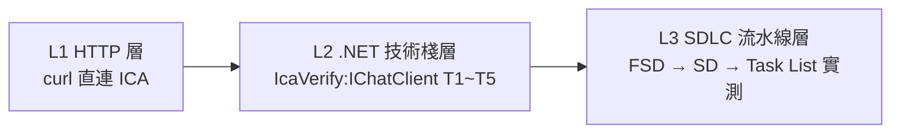
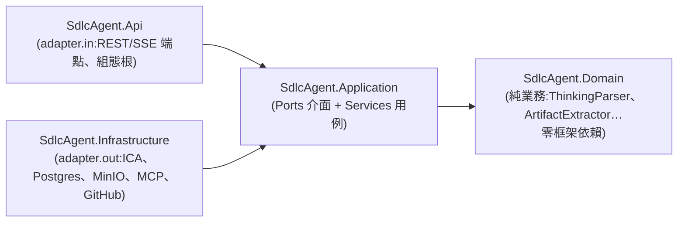

# sdlc-agentic-platform-dotnet — LLM 連線驗證與 SDLC 流水線實測

> 本分支(`sdlc-agentic-platform-dotnet`)是對
> [**sdlc-agentic-platform-dotnet**](https://github.com/ChunPingWang/sdlc-agentic-platform-dotnet) 這個 .NET 平台規劃 repo 的
> **完整可用性驗證產出**:證明它規劃的技術棧能透過環境變數 `ICA_API_URL` / `ICA_CLAUDE_KEY`
> 正確呼叫 LLM(IBM ICA Gateway 上的 Claude 模型),並用
> [sdlc-demo-copilot](https://github.com/ChunPingWang/sdlc-demo-copilot) 的 **fsd / sd** skill 素材實際跑完一輪文件產出流水線。
>
> **結論:✅ 全部通過**(HTTP 層 3/3、.NET 技術棧層 5/5、SDLC 流水線 3/3)。詳見 [VERIFICATION-REPORT.md](VERIFICATION-REPORT.md)。

---

## 目錄

1. [這個分支放了什麼](#1-這個分支放了什麼)
2. [被驗證的平台是什麼(初學者導讀)](#2-被驗證的平台是什麼初學者導讀)
3. [驗證過程](#3-驗證過程)
4. [驗證結果](#4-驗證結果)
5. [動手重現(step by step)](#5-動手重現step-by-step)
6. [初學者教學:讀懂整個平台 repo](#6-初學者教學讀懂整個平台-repo)
7. [名詞小字典](#7-名詞小字典)

---

## 1. 這個分支放了什麼

```
.
├── README.md                     ← 你正在讀的檔案(驗證說明 + 教學)
├── VERIFICATION-REPORT.md        ← 詳細驗證報告(三層驗證的完整數據)
├── verification/
│   ├── IcaVerify/                ← .NET 10 驗證程式(M.E.AI IChatClient → ICA)
│   │   ├── Program.cs            ←   T1~T5 驗證 + gen 文件生成模式,約 150 行
│   │   └── IcaVerify.csproj
│   ├── prompts/                  ← FSD/SD/TaskList 生成用的完整提示檔(可逐字重現)
│   └── evidence/
│       ├── http-check.md         ← curl 直連 ICA 的原始回應(金鑰已遮罩)
│       └── icaverify-run.md      ← IcaVerify T1~T5 執行輸出
└── sdlc/                         ← 流水線實測產出(結構沿用 sdlc-demo-copilot)
    ├── inputs/LIFE-PREMIUM-requirements.md   ← 需求輸入(壽險保費試算)
    ├── fsd/output/
    │   ├── FSD-LIFE-v1.0.md                  ← LLM 產出的功能規格文件(13 章)
    │   └── features/*.feature                ← 從 FSD 第 13 章抽出的 zh-TW Gherkin(17 場景)
    └── sd/output/
        ├── SD-LIFE-v1.0.md                   ← LLM 產出的系統設計文件(13 章)
        └── TASK-LIST-LIFE-v1.0.md            ← LLM 產出的開發工作清單(Red/Green/Refactor)
```

## 2. 被驗證的平台是什麼(初學者導讀)

[sdlc-agentic-platform-dotnet](https://github.com/ChunPingWang/sdlc-agentic-platform-dotnet) 是一個
**類 Open WebUI 的多模型 AI Agent 平台**的 .NET 架構規劃 repo(Java 版為
[gherkins-converter](https://github.com/ChunPingWang/gherkins-converter)),核心能力:

- 透過 **OpenAI-Compatible Gateway(IBM ICA)** 呼叫 Claude 模型 —— 也就是本次驗證的重點
- 以 **Agent Profile**(版本化的 system prompt)驅動對話
- **五階段 SDLC 流水線**:需求 → Gherkin 規格 → 業務文件(Word)→ 程式碼 → 審查
- **SSE 串流** 即時呈現思考過程(`thinking`)、內容(`content`)、工具呼叫(`tool_call`)、日誌(`log`)、結束(`done`)五型事件
- 產出可依 GitFlow 發布至 GitHub;可觀測性收斂到 Langfuse

一句話:**你丟需求文件進去,平台用 LLM 一路把規格、設計、程式碼生出來,而且每一步都看得到過程、留得下版本。**
本分支的 `sdlc/` 目錄就是「規格 → 設計」這一段的真實產出示範。

## 3. 驗證過程

驗證分三層、由淺入深,每層對應平台的真實元件,任何一層失敗都能立刻定位問題在哪:



### L1:HTTP 層 — Gateway 本身可用嗎?

用 `curl` 直連 `$ICA_API_URL`,確認三件事:模型清單、非串流對話、SSE 串流對話。
同時探測出正確的 base path 是 **`{ICA_API_URL}/v1`**(`/models`、`/openai/v1/models` 都是 404)。
原始回應存於 [verification/evidence/http-check.md](verification/evidence/http-check.md)。

### L2:.NET 技術棧層 — 規劃書選的套件真的接得上嗎?

寫了一支約 150 行的主控台程式 [IcaVerify](verification/IcaVerify/Program.cs),
**完全遵守平台的架構約束**來連 ICA:

- 只透過 `Microsoft.Extensions.AI` 的 **`IChatClient`** 抽象呼叫模型(架構約束 #3:不得直接用 `HttpClient` 打模型 API)
- 金鑰**只從環境變數**載入,程式內無任何明碼(約束 #8)
- 環境變數名稱沿用 Java 版:`ICA_API_URL`、`ICA_CLAUDE_KEY`(約束 #10)

關鍵接線只有三行 —— 這就是未來 `OpenAiCompatibleChatClientAdapter` 的核心:

```csharp
var openAiClient = new OpenAIClient(
    new ApiKeyCredential(apiKey),                                  // ← ICA_CLAUDE_KEY
    new OpenAIClientOptions { Endpoint = new Uri($"{apiUrl}/v1") });  // ← ICA_API_URL + /v1
IChatClient chatClient = openAiClient.GetChatClient("claude-sonnet-4-5").AsIChatClient();
```

五個測項(T1~T5)各自對應平台的一個規劃元件,詳見 [VERIFICATION-REPORT.md §3](VERIFICATION-REPORT.md)。

### L3:SDLC 流水線層 — LLM 能照 skill 模板產出合格文件嗎?

拿 [sdlc-demo-copilot](https://github.com/ChunPingWang/sdlc-demo-copilot) 的素材實測「規格 → 設計」流水線:

1. **FSD**:system prompt = `generate-fsd` SKILL 規範 + FSD 模板;user = 壽險保費試算需求 → 產出 13 章 FSD(含 C4 圖與 Gherkin)
2. **SD**:system prompt = `generate-sd` SKILL 規範 + SD/ADR 模板 + demo repo 的 6 個既有 Accepted ADR(沿用為既定前提);user = 上一步的 FSD → 產出 13 章 SD
3. **Task List**:generate-sd Phase 2 規範 + 上一步的 SD → 產出 Red/Green/Refactor 工作清單

三次呼叫都走 `IcaVerify` 的 **gen 模式**(即 `IChatClient.GetStreamingResponseAsync` 串流),
與平台正式運作方式一致。最後用正規表達式從 FSD 第 13 章抽出 ```` ```gherkin ```` code fence
存成 `.feature` 檔 —— 這正是平台 `ArtifactExtractor` 元件(約束 #6)要做的事。

> 說明:demo repo 的 skill 原設計有 HITL(人工確認)停點;本次是「連通性 + 產出品質」的自動化驗證,
> 因此提示中明示略過停點、一次產完。正式平台上 HITL 仍由前端互動實現。

## 4. 驗證結果

| 層次 | 測項 | 結果 |
|------|------|------|
| L1 HTTP | models / 非串流 chat / SSE 串流 | ✅ 3/3(HTTP 200,標準 OpenAI 協定) |
| L2 .NET | T1 模型目錄、T2 非串流、T3 串流、T4 System Prompt、T5 gherkin fence | ✅ 5/5 |
| L3 流水線 | FSD(23.5K 字元)、SD(16.9K)、Task List(27.2K) | ✅ 3/3,結構檢核全過 |

重點結論(完整版見 [VERIFICATION-REPORT.md §5](VERIFICATION-REPORT.md)):

1. `ICA_API_URL` / `ICA_CLAUDE_KEY` **配置正確、完整可用**;可用 Claude 模型:`claude-sonnet-4-5`、`claude-haiku-4-5`、`claude-sonnet-5`、`claude-sonnet-4-6`
2. 規劃書的 **M.E.AI `IChatClient` + OpenAI-compatible 端點** 選型成立,零自訂 HTTP 程式即可對接 ICA
3. 實作 adapter 時 endpoint 要組成 `{ICA_API_URL}/v1`
4. 長文件串流一次 2~3 分鐘,平台規劃的 SSE 心跳與 Ingress 逾時設定確有必要

## 5. 動手重現(step by step)

前置:.NET 10 SDK、可連外網路、一組 ICA 金鑰。

```bash
# 1. 取得本分支
git clone -b sdlc-agentic-platform-dotnet https://github.com/ChunPingWang/agentic-platform-outcome-0909.git
cd agentic-platform-outcome-0909

# 2. 設定環境變數(金鑰請向管理者索取,切勿寫進任何檔案)
export ICA_API_URL="https://api.nextgen-beta.ica.ibm.com/ica"
export ICA_CLAUDE_KEY="sk-********"

# 3. 跑 T1~T5 驗證(約 15 秒)
cd verification/IcaVerify
dotnet run                        # 期望輸出:5 通過 / 0 失敗,exit code 0

# 4.(選用)重跑 FSD 生成 —— 體驗流水線第一段(約 3 分鐘)
dotnet run -- gen ../prompts/fsd-system.md ../prompts/fsd-user.md /tmp/FSD-out.md
```

想換模型?設 `ICA_MODEL=claude-haiku-4-5` 再跑一次即可(程式讀取該環境變數,預設 `claude-sonnet-4-5`)。

## 6. 初學者教學:讀懂整個平台 repo

以下帶你逐步讀懂 [sdlc-agentic-platform-dotnet](https://github.com/ChunPingWang/sdlc-agentic-platform-dotnet)。
建議按順序閱讀,每一步都有「為什麼」。

### 第 1 步:先讀 `README.md` 與 `CLAUDE.md`

- `README.md`:一頁看懂專案定位(Java 版的 .NET 對應)、技術棧對照表、C4 Container 圖
- `CLAUDE.md`:給 AI 協作開發者(Claude Code)的守則,但對人類也是最濃縮的**架構約束清單**——
  10 條約束就是整個系統的「不變式」,例如:Domain 零框架依賴、SSE 固定五型事件、API 契約先行、DB schema 只增不改

### 第 2 步:讀 `docs/00-dotnet-架構規劃書.md`(核心文件)

規劃書回答四個問題:

| 問題 | 章節 | 你會學到 |
|------|------|---------|
| 用什麼技術? | §2 技術棧對照 | 每項選型都同時給 Java 版對照與理由,適合學「如何做技術選型」 |
| 長什麼樣子? | §3 C4 圖 | System Context → Container → Component 三層視角 |
| 程式怎麼擺? | §4 方案結構 | 4 個 src 專案 + 6 個測試專案的六角架構(見下) |
| 核心流程怎麼跑? | §5 對應表 | 串流管線 `IChatModelPort → ChatService → SSE` 等關鍵程式碼草稿 |

### 第 3 步:理解六角架構(Hexagonal / Ports & Adapters)

平台用**專案參考方向**強制分層,依賴只能往內指:



初學者最該記住的一句話:**Domain 不知道資料庫、不知道 HTTP、不知道 LLM 的存在**。
換 LLM 供應商只動 Infrastructure 的 adapter(例如本次驗證的 ICA 接線),業務邏輯一行不改。
這條規則不是靠自律,而是靠 `SdlcAgent.Architecture.Tests`(ArchUnitNET)在 CI 自動守門。

### 第 4 步:看契約與規格 —— 「先寫規格,再寫程式」

- `specs/openapi.yaml`:所有 REST 端點的**唯一真相**(契約先行,約束 #7)。前端與 Java 版共用同一份,後端換棧前端零修改
- `specs/features/*.feature`:7 個檔、38 個 zh-TW Gherkin 驗收場景(BDD-first,約束 #2)。
  每個功能任務都先有 `.feature`,再用 Reqnroll 綁定步驟實作 —— 本分支 `sdlc/fsd/output/features/` 的產出就是同一套寫法

### 第 5 步:看 ADR —— 學「為什麼這樣設計」

`docs/adr/` 有 11 篇架構決策紀錄:ADR-001~007 對應 Java 版既有決策(Provider 抽象、SSE 串流、事件型別…),
ADR-008~011 是 .NET 新增(方案佈局、資料存取、串流原語、Reqnroll)。
每篇都是 Context / Decision / Alternatives / Consequences 格式 —— 讀 ADR 是初學者理解「取捨」最快的方式,
本分支 SD 產出裡沿用的 6 個 ADR 也是同一格式。

### 第 6 步:對照本分支,把抽象變具體

| 平台規劃的元件 | 本分支的具體對照物 |
|----------------|-------------------|
| `OpenAiCompatibleChatClientAdapter` | [verification/IcaVerify/Program.cs](verification/IcaVerify/Program.cs) 的三行接線 |
| `IChatModelPort.StreamAsync` → SSE `content` | IcaVerify T3 / gen 模式的 `GetStreamingResponseAsync` |
| Agent Profile system prompt | [verification/prompts/](verification/prompts/) 的 `*-system.md` |
| 五階段流水線的「規格 → 設計」段 | [sdlc/](sdlc/) 的 FSD → SD → Task List |
| `ArtifactExtractor`(```gherkin 抽取) | [sdlc/fsd/output/features/](sdlc/fsd/output/features/) 的兩個 `.feature` |

### 第 7 步:接下來可以做什麼

1. 照平台 repo `docs/tasks/TASKS.md` 從 Phase 0 WP1-T1 開始實作 backend 骨架
2. 實作 `OpenAiCompatibleChatClientAdapter` 時直接沿用本分支驗證過的接線與 endpoint 規則
3. 用 `docker compose -f docker/compose.yaml up -d` 起 postgres + minio + langfuse,體驗完整基礎設施

## 7. 名詞小字典

| 名詞 | 白話解釋 |
|------|---------|
| **ICA** | IBM 的 LLM Gateway,對外提供 OpenAI 相容 API,後面接 Claude 等多家模型 |
| **OpenAI-Compatible** | 照 OpenAI 的 API 格式(`/v1/chat/completions` 等)實作的服務;好處是所有支援 OpenAI 的 SDK 都能直接用 |
| **M.E.AI / `IChatClient`** | Microsoft.Extensions.AI,.NET 官方的 LLM 抽象層;程式只認 `IChatClient` 介面,換模型供應商不改業務碼 |
| **FSD** | Functional Specification Document,功能規格文件:系統「要做什麼」(功能、流程、驗收標準) |
| **SD** | System Design Document,系統設計文件:系統「怎麼做」(元件、API、資料表、部署) |
| **ADR** | Architecture Decision Record,架構決策紀錄:記下「為什麼選 A 不選 B」,含替代方案與代價 |
| **BDD / Gherkin** | 行為驅動開發;Gherkin 是用「功能/場景/假設/當/那麼」寫的可執行規格語言(zh-TW 也支援) |
| **SSE** | Server-Sent Events,伺服器單向推播;平台用它把 LLM 的思考與內容即時串流到前端 |
| **六角架構** | 把業務核心(Domain)放中間,所有外部技術(DB、HTTP、LLM)都透過 Port 介面 + Adapter 插在外圈 |
| **HITL** | Human-in-the-loop,流水線中的人工確認停點(例如架構師核准 ADR 後才繼續) |
| **MCP** | Model Context Protocol,讓 LLM 以標準協定呼叫外部工具(平台用它接 Mural 看板) |
| **Langfuse** | LLM 可觀測性平台:每次呼叫的 prompt、回覆、token、耗時都留 trace 可回放 |

---

*本分支由驗證流程自動產出於 2026-09-14;LLM 生成之 FSD/SD/Task List 為驗證示範,採用前仍應經 HITL 審閱。*
