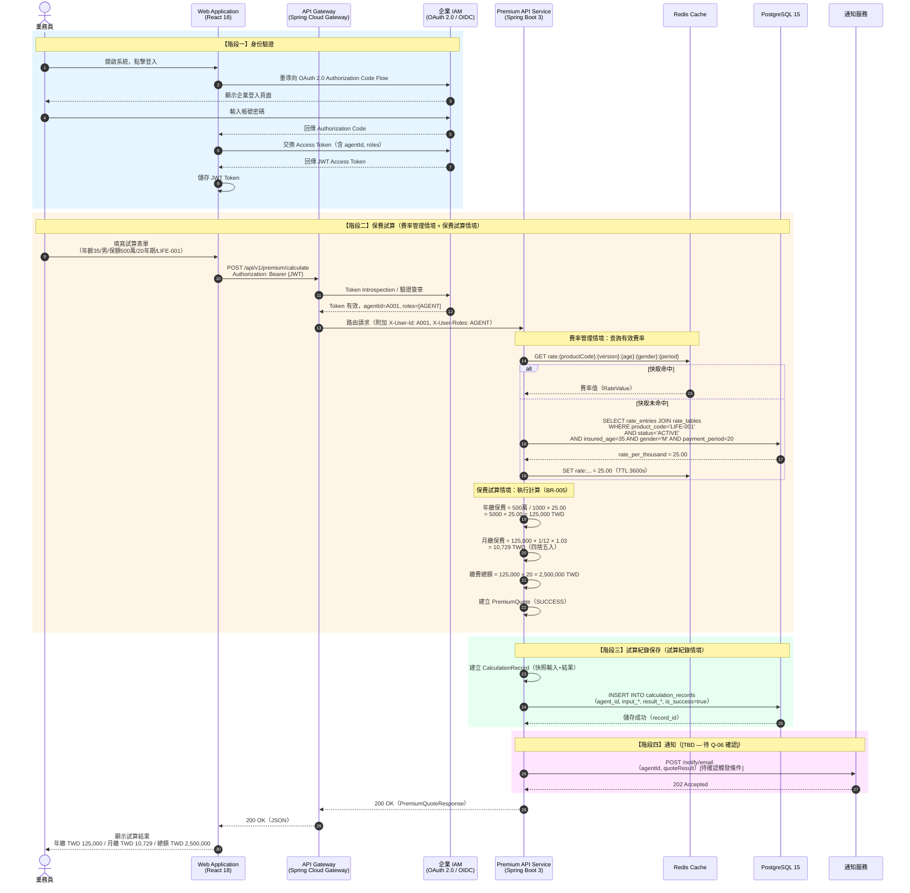
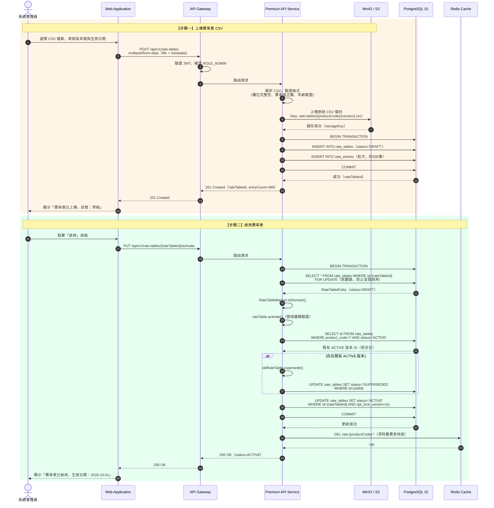
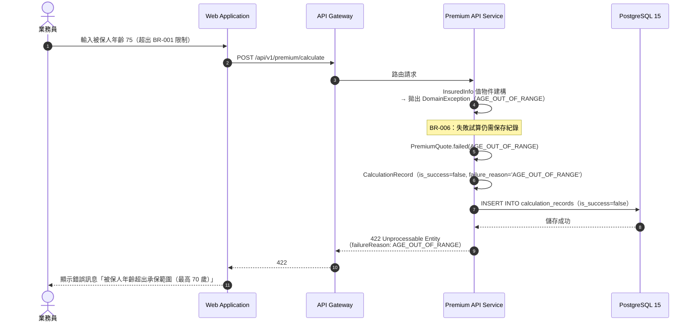
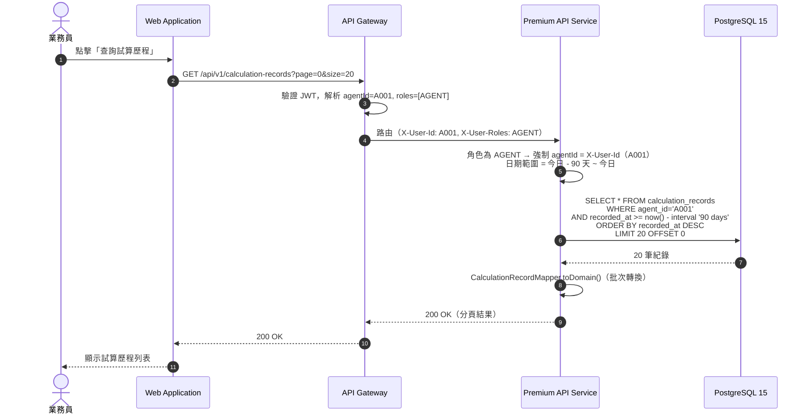

# 技術需求文件（Technical Requirements Document）

**文件編號：** TRD-LIFE-v1.0
**專案名稱：** 壽險新保件保費試算系統
**版本：** 1.0
**建立日期：** 2026-09-07
**文件狀態：** 草稿（待架構委員會核准）
**依據文件：** FSD-LIFE-v1.0、LIFE-PREMIUM-requirements.md

---

## 文件修訂紀錄

| 版本 | 日期 | 修訂人 | 修訂說明 |
|------|------|--------|----------|
| 0.1 | 2026-09-07 | 解決方案架構師 | 初稿建立 |

---

## ⚠️ 待確認事項（BLOCKING — 需人工裁決後方可繼續）

下列事項輸入文件中未明確說明，**不得自行假設**，請業務分析師或架構委員會於 **2026-09-14 前** 回覆，否則對應章節將保持空白或標記 `[TBD]`。

| 編號 | 問題 | 影響範圍 | 優先級 |
|------|------|---------|--------|
| Q-01 | Java 版本是否確定為 17？FSD 提及 Java 17 / Spring Boot 3，是否已通過企業 IT 標準審查？ | 架構約束 §2 | BLOCKING |
| Q-02 | 建置工具：Maven 或 Gradle？版本？ | 架構約束 §2、CI/CD | BLOCKING |
| Q-03 | ORM 框架：FSD 提及 JPA，是否確定使用 Spring Data JPA + Hibernate？或允許 MyBatis？ | 架構約束 §2、Mapper 層設計 | BLOCKING |
| Q-04 | 企業 IAM 系統的 OAuth 2.0 / OIDC 實作廠商為何（Keycloak、Azure AD、Okta…）？JWT 簽章演算法（RS256/ES256）？Token 有效期限？ | 認證設計 §6 | BLOCKING |
| Q-05 | 訪客（Guest）匿名試算：是否需要任何速率限制（Rate Limiting）或 CAPTCHA 防濫用機制？ | 安全設計 §6 | BLOCKING |
| Q-06 | 通知服務（Email）：試算結果 Email 是否為 MVP 必要功能？FSD 架構圖有列出但功能規格未描述觸發條件與收件人邏輯。 | 功能範圍 §3 | BLOCKING |
| Q-07 | 費率表 CSV 匯入：SFTP 批次與 API 上傳兩種方式是否均需在 MVP 實作？SFTP 排程頻率？ | 功能範圍 §3 | BLOCKING |
| Q-08 | 客戶是否提供現有資料庫 DDL（CREATE TABLE）？若有，請提供；若無，本文件將依領域模型設計資料表並請確認。 | Mapper 層設計 §7 | BLOCKING |
| Q-09 | Redis Session 管理：API Gateway 層的 Session 是否使用 Spring Session + Redis，或純 JWT Stateless？ | 架構約束 §2 | BLOCKING |
| Q-10 | 測試環境：是否有 CI/CD pipeline（Jenkins/GitHub Actions/GitLab CI）？單元測試覆蓋率門檻？ | 測試策略 §9 | 非 BLOCKING（可後補）|
| Q-11 | 「保障倍數說明」輸出欄位：計算邏輯為何？FSD 未定義公式。 | 領域模型 §5 | BLOCKING |
| Q-12 | 幣別：需求文件提及新台幣（TWD），是否為唯一幣別？是否需要多幣別擴充預留？ | 領域模型 §5 | 非 BLOCKING（可後補）|

> **Pipeline 第 1 條**：以上問題在獲得人工確認前，對應章節以 `[TBD — 待 Q-XX 確認]` 標記，不自行填入假設值。

---

## 目錄

1. [文件目的與範圍](#1-文件目的與範圍)
2. [架構約束（Architecture Constraints）](#2-架構約束)
3. [有界情境（Bounded Contexts）](#3-有界情境)
4. [領域模型（Domain Model）](#4-領域模型)
5. [資料庫 Schema 與 Mapper 層設計](#5-資料庫-schema-與-mapper-層設計)
6. [API 設計](#6-api-設計)
7. [安全設計](#7-安全設計)
8. [循序圖（Sequence Diagrams）](#8-循序圖)
9. [測試策略](#9-測試策略)
10. [驗收要點（Acceptance Criteria）](#10-驗收要點)
11. [建置與驗證步驟](#11-建置與驗證步驟)

---

## 1. 文件目的與範圍

### 1.1 目的

本文件為**壽險新保件保費試算系統**的技術需求規格，供開發團隊實作、架構委員會審查、QA 測試計畫制定使用。本文件以 FSD-LIFE-v1.0 為業務需求權威來源，不重複定義業務規則，僅說明技術實現約束。

### 1.2 範圍

- 後端 Java 服務（Premium API Service）的架構約束
- 領域模型設計（persistence-free）
- 資料庫 Schema 設計與 Mapper 防腐層
- REST API 規格
- 安全認證設計
- 測試策略與驗收要點

### 1.3 不在範圍

- 前端（React）實作細節
- 基礎設施佈署（Kubernetes / Docker Compose 配置）
- Phase 2 功能（投保申請、核保、保單管理、理賠）

---

## 2. 架構約束

> **說明：** 本章列出所有已確認的技術選型約束。標記 `[TBD]` 者待對應 Q 號問題確認後填入。

### 2.1 已確認約束（來自 FSD-LIFE-v1.0）

| 類別 | 約束 | 版本 / 規格 | 來源 |
|------|------|------------|------|
| 程式語言 | Java | 17（LTS）[待 Q-01 確認] | FSD §5.2 |
| 應用框架 | Spring Boot | 3.x [待 Q-01 確認] | FSD §5.2 |
| API Gateway | Spring Cloud Gateway | 與 Spring Boot 3 相容版本 | FSD §5.2 |
| 資料庫 | PostgreSQL | 15 | FSD §5.2 |
| 快取 | Redis | 7 | FSD §5.2 |
| 物件儲存 | MinIO 或 AWS S3 相容 | — | FSD §5.2 |
| 前端框架 | React | 18 + TypeScript | FSD §5.2 |
| API 風格 | REST / JSON over HTTPS | — | FSD §5.1 |
| 認證協定 | OAuth 2.0 / OIDC + JWT | [待 Q-04 確認] | FSD §5.1 |
| 架構模式 | 三層式（Controller / Service / Repository）| — | Pipeline 第 8 條 |

### 2.2 待確認約束

| 類別 | 問題編號 | 暫定說明 |
|------|---------|---------|
| 建置工具 | Q-02 | [TBD — 待 Q-02 確認] |
| ORM 框架 | Q-03 | [TBD — 待 Q-03 確認] |
| IAM 廠商 / JWT 演算法 | Q-04 | [TBD — 待 Q-04 確認] |
| Session 策略 | Q-09 | [TBD — 待 Q-09 確認] |

### 2.3 架構模式說明

本系統後端採用**三層式架構**：

```
┌─────────────────────────────────────────────────────┐
│  Controller Layer（REST API 入口，參數驗證，HTTP 映射）  │
├─────────────────────────────────────────────────────┤
│  Service Layer（業務邏輯、領域模型操作、交易邊界）         │
├─────────────────────────────────────────────────────┤
│  Repository Layer（資料存取介面，隔離持久化細節）          │
├─────────────────────────────────────────────────────┤
│  Mapper Layer（領域聚合 ↔ 資料表記錄 防腐轉換）           │
└─────────────────────────────────────────────────────┘
```

**強制邊界規則：**
- Controller 不得直接呼叫 Repository
- 領域模型（Domain Model）不得標注任何持久化框架 annotation（`@Entity`、`@Table` 等）
- Service 層持有交易邊界（`@Transactional`）
- Mapper 層負責聚合 ↔ 多表同交易的轉換，是唯一知道 ORM 實體的層

---

## 3. 有界情境（Bounded Contexts）

> **說明：** 本章依事件風暴分析識別出三個有界情境，各自擁有獨立的領域模型與 Repository。

### 3.1 有界情境地圖

```
┌──────────────────────────────────────────────────────────────────┐
│                    壽險保費試算系統（LIFE）                          │
│                                                                  │
│  ┌─────────────────────┐    ┌──────────────────────────────────┐ │
│  │  費率管理情境          │    │  保費試算情境                      │ │
│  │  Rate Management    │    │  Premium Calculation             │ │
│  │                     │    │                                  │ │
│  │  Aggregate:         │    │  Aggregate:                      │ │
│  │  - RateTable        │───▶│  - PremiumQuote                  │ │
│  │                     │    │                                  │ │
│  │  Domain Events:     │    │  Domain Events:                  │ │
│  │  - RateTablePublished│   │  - PremiumCalculated             │ │
│  │  - RateTableActivated│   │  - PremiumCalculationFailed      │ │
│  └─────────────────────┘    └──────────────────────────────────┘ │
│                                        │                         │
│                             ┌──────────▼──────────────────────┐  │
│                             │  試算紀錄情境                      │  │
│                             │  Calculation Record              │  │
│                             │                                  │  │
│                             │  Aggregate:                      │  │
│                             │  - CalculationRecord             │  │
│                             │                                  │  │
│                             │  Domain Events:                  │  │
│                             │  - RecordSaved                   │  │
│                             └──────────────────────────────────┘  │
└──────────────────────────────────────────────────────────────────┘
```

> **圖 3-1：有界情境地圖**
> 本圖依據 FSD-LIFE-v1.0 §4 業務功能範圍識別出三個有界情境。費率管理情境提供費率資料給保費試算情境（上游→下游關係）；試算情境在計算完成後觸發紀錄保存。

### 3.2 情境說明

| 有界情境 | 職責 | 主要 Aggregate | 上游/下游 |
|---------|------|--------------|---------|
| 費率管理（Rate Management）| 費率表版本管理、CSV 匯入、生效日期控管 | RateTable | 上游 |
| 保費試算（Premium Calculation）| 保費計算邏輯、業務規則驗證 | PremiumQuote | 下游（消費費率）|
| 試算紀錄（Calculation Record）| 試算結果保存、歷程查詢 | CalculationRecord | 下游（接收試算結果）|

---

## 4. 領域模型（Domain Model）

> **重要：** 本章所有領域物件均為 **persistence-free**，不標注任何 ORM annotation。持久化映射由 §5 Mapper 層負責。

### 4.1 費率管理情境（Rate Management Context）

```java
// ── Value Objects ──────────────────────────────────────────────

/** 費率查詢鍵：年齡 + 性別 + 繳費年期 */
public record RateKey(
    int insuredAge,          // 足歲，0–70
    Gender gender,           // MALE / FEMALE
    PaymentPeriod paymentPeriod  // YEAR_10 / YEAR_20 / YEAR_30 / WHOLE_LIFE
) {}

/** 費率值：每千元保額對應保費（新台幣 TWD） */
public record RateValue(
    BigDecimal ratePerThousand,  // 費率，正數
    Currency currency            // TWD
) {
    public RateValue {
        if (ratePerThousand.compareTo(BigDecimal.ZERO) <= 0)
            throw new IllegalArgumentException("費率必須為正數");
    }
}

/** 費率表版本號 */
public record RateTableVersion(String value) {
    public RateTableVersion {
        if (value == null || value.isBlank())
            throw new IllegalArgumentException("版本號不得為空");
    }
}

// ── Enums ──────────────────────────────────────────────────────

public enum Gender { MALE, FEMALE }

public enum PaymentPeriod {
    YEAR_10(10), YEAR_20(20), YEAR_30(30), WHOLE_LIFE(99);
    private final int code;
    PaymentPeriod(int code) { this.code = code; }
    public int getCode() { return code; }
    public static PaymentPeriod fromCode(int code) { /* ... */ }
}

public enum RateTableStatus { DRAFT, ACTIVE, SUPERSEDED }

// ── Aggregate Root ─────────────────────────────────────────────

/**
 * 費率表聚合根
 * 不變式：ACTIVE 狀態的費率表在同一商品同一時間只能有一個
 */
public class RateTable {
    private final RateTableId id;
    private final String productCode;          // 保險商品代碼
    private final RateTableVersion version;
    private RateTableStatus status;
    private final LocalDate effectiveDate;     // 生效日期（不得早於今日）
    private final LocalDateTime createdAt;
    private final String createdBy;            // Admin userId
    private final Map<RateKey, RateValue> rates;  // 費率明細
    private int optimisticLockVersion;         // 樂觀鎖版本

    // 業務方法
    public void activate() {
        if (this.status != RateTableStatus.DRAFT)
            throw new DomainException("只有 DRAFT 狀態可以啟用");
        if (effectiveDate.isBefore(LocalDate.now()))
            throw new DomainException("生效日期不得早於今日");
        this.status = RateTableStatus.ACTIVE;
        // 發布 RateTableActivated 事件
    }

    public void supersede() {
        if (this.status != RateTableStatus.ACTIVE)
            throw new DomainException("只有 ACTIVE 狀態可以被取代");
        this.status = RateTableStatus.SUPERSEDED;
    }

    public Optional<RateValue> findRate(RateKey key) {
        return Optional.ofNullable(rates.get(key));
    }

    // Domain Events（由 Service 層發布）
    public record RateTablePublished(RateTableId tableId, String productCode,
                                     RateTableVersion version, LocalDate effectiveDate) {}
    public record RateTableActivated(RateTableId tableId, String productCode,
                                     LocalDate effectiveDate) {}
}
```

### 4.2 保費試算情境（Premium Calculation Context）

```java
// ── Value Objects ──────────────────────────────────────────────

/** 被保人資訊 */
public record InsuredInfo(
    int age,        // 足歲，0–70（BR-001）
    Gender gender
) {
    public InsuredInfo {
        if (age < 0 || age > 70)
            throw new DomainException("被保人年齡超出承保範圍（BR-001）");
    }
}

/** 保額（新台幣萬元） */
public record SumAssured(
    int amountInTenThousand,  // 萬元整數，100–5000（BR-002）
    Currency currency          // TWD
) {
    public SumAssured {
        if (amountInTenThousand < 100 || amountInTenThousand > 5000)
            throw new DomainException("保額超出限制（BR-002）");
    }
    /** 轉換為元 */
    public BigDecimal toFullAmount() {
        return BigDecimal.valueOf(amountInTenThousand).multiply(BigDecimal.valueOf(10_000));
    }
}

/** 試算輸入參數 */
public record QuoteInput(
    InsuredInfo insuredInfo,
    SumAssured sumAssured,
    PaymentPeriod paymentPeriod,
    String productCode
) {}

/** 保費計算結果（新台幣元） */
public record PremiumResult(
    BigDecimal annualPremium,   // 年繳保費（四捨五入至個位，TWD）
    BigDecimal monthlyPremium,  // 月繳保費（年繳 × 1/12 × 1.03，四捨五入至個位，TWD）
    BigDecimal totalPremium,    // 繳費總額（年繳 × 繳費年期，TWD）
    String coverageMultipleDescription,  // 保障倍數說明 [待 Q-11 確認]
    Currency currency
) {}

// ── Aggregate Root ─────────────────────────────────────────────

/**
 * 保費試算聚合根
 * 封裝一次完整的試算行為與結果
 */
public class PremiumQuote {
    private final QuoteId id;
    private final QuoteInput input;
    private QuoteStatus status;           // SUCCESS / FAILED
    private PremiumResult result;         // 成功時有值
    private FailureReason failureReason;  // 失敗時有值
    private final LocalDateTime quotedAt;
    private final String requesterId;    // agentId 或 null（訪客）
    private int optimisticLockVersion;

    public enum QuoteStatus { SUCCESS, FAILED }

    public enum FailureReason {
        AGE_OUT_OF_RANGE,       // 年齡超限（BR-001）
        SUM_ASSURED_OUT_OF_RANGE, // 保額超限（BR-002）
        RATE_NOT_FOUND          // 費率資料不存在（BR-006）
    }

    // 靜態工廠：成功試算
    public static PremiumQuote success(QuoteId id, QuoteInput input,
                                        PremiumResult result, String requesterId) { /* ... */ }

    // 靜態工廠：失敗試算
    public static PremiumQuote failed(QuoteId id, QuoteInput input,
                                       FailureReason reason, String requesterId) { /* ... */ }
}
```

### 4.3 試算紀錄情境（Calculation Record Context）

```java
/**
 * 試算紀錄聚合根
 * 保存每次試算的完整快照（BR-006）
 */
public class CalculationRecord {
    private final RecordId id;
    private final String agentId;          // null 表示訪客
    private final LocalDateTime recordedAt;
    private final RecordedInput input;     // 試算輸入快照
    private final RecordedResult result;   // 試算結果快照（含失敗原因）
    private final boolean isSuccess;
    private int optimisticLockVersion;

    public record RecordedInput(
        int insuredAge, String gender, int sumAssuredInTenThousand,
        int paymentPeriodCode, String productCode, String currency
    ) {}

    public record RecordedResult(
        BigDecimal annualPremium,    // null if failed
        BigDecimal monthlyPremium,   // null if failed
        BigDecimal totalPremium,     // null if failed
        String coverageMultipleDescription,  // null if failed
        String failureReason,        // null if success
        String currency
    ) {}
}
```

---

## 5. 資料庫 Schema 與 Mapper 層設計

> **說明（Pipeline 第 3 條）：** 客戶尚未提供現有 DDL（待 Q-08 確認）。本章依領域模型設計資料表 Schema，**請客戶確認後視為客戶 Schema，後續不得因領域模型調整而修改資料表結構**。若客戶提供既有 DDL，本章將以客戶 DDL 為準，領域模型保持不變，僅調整 Mapper 層。

### 5.1 資料庫 Schema（PostgreSQL 15）

```sql
-- ================================================================
-- 費率管理情境
-- ================================================================

CREATE TABLE rate_tables (
    id                  UUID            NOT NULL DEFAULT gen_random_uuid(),
    product_code        VARCHAR(20)     NOT NULL,
    version             VARCHAR(50)     NOT NULL,
    status              VARCHAR(20)     NOT NULL,
    effective_date      DATE            NOT NULL,
    created_at          TIMESTAMPTZ     NOT NULL DEFAULT now(),
    created_by          VARCHAR(100)    NOT NULL,
    csv_storage_key     VARCHAR(500),   -- MinIO/S3 原始檔路徑
    opt_lock_version    INTEGER         NOT NULL DEFAULT 0,
    CONSTRAINT pk_rate_tables PRIMARY KEY (id),
    CONSTRAINT uq_rate_tables_product_version UNIQUE (product_code, version),
    CONSTRAINT ck_rate_tables_status CHECK (status IN ('DRAFT','ACTIVE','SUPERSEDED')),
    CONSTRAINT ck_rate_tables_effective_date CHECK (effective_date >= CURRENT_DATE)
);

CREATE TABLE rate_entries (
    id              UUID            NOT NULL DEFAULT gen_random_uuid(),
    rate_table_id   UUID            NOT NULL,
    insured_age     SMALLINT        NOT NULL,
    gender          CHAR(1)         NOT NULL,
    payment_period  SMALLINT        NOT NULL,
    rate_per_thousand NUMERIC(10,6) NOT NULL,
    currency        CHAR(3)         NOT NULL DEFAULT 'TWD',
    CONSTRAINT pk_rate_entries PRIMARY KEY (id),
    CONSTRAINT fk_rate_entries_table FOREIGN KEY (rate_table_id)
        REFERENCES rate_tables(id) ON DELETE CASCADE,
    CONSTRAINT uq_rate_entries_key UNIQUE (rate_table_id, insured_age, gender, payment_period),
    CONSTRAINT ck_rate_entries_gender CHECK (gender IN ('M','F')),
    CONSTRAINT ck_rate_entries_payment_period CHECK (payment_period IN (10,20,30,99)),
    CONSTRAINT ck_rate_entries_age CHECK (insured_age BETWEEN 0 AND 70),
    CONSTRAINT ck_rate_entries_rate CHECK (rate_per_thousand > 0)
);

CREATE INDEX idx_rate_entries_table_id ON rate_entries(rate_table_id);
CREATE INDEX idx_rate_tables_product_status ON rate_tables(product_code, status);

-- ================================================================
-- 保費試算情境 & 試算紀錄情境
-- ================================================================

CREATE TABLE calculation_records (
    id                          UUID            NOT NULL DEFAULT gen_random_uuid(),
    agent_id                    VARCHAR(100),   -- NULL 表示訪客
    recorded_at                 TIMESTAMPTZ     NOT NULL DEFAULT now(),
    -- 輸入快照
    input_insured_age           SMALLINT        NOT NULL,
    input_gender                CHAR(1)         NOT NULL,
    input_sum_assured_wan       INTEGER         NOT NULL,  -- 萬元
    input_payment_period        SMALLINT        NOT NULL,
    input_product_code          VARCHAR(20)     NOT NULL,
    input_currency              CHAR(3)         NOT NULL DEFAULT 'TWD',
    -- 結果快照
    is_success                  BOOLEAN         NOT NULL,
    result_annual_premium       NUMERIC(15,0),  -- 元，四捨五入
    result_monthly_premium      NUMERIC(15,0),  -- 元，四捨五入
    result_total_premium        NUMERIC(15,0),  -- 元
    result_coverage_description TEXT,
    result_failure_reason       VARCHAR(50),
    result_currency             CHAR(3),
    -- 費率表版本追蹤
    rate_table_id               UUID,
    rate_table_version          VARCHAR(50),
    -- 樂觀鎖
    opt_lock_version            INTEGER         NOT NULL DEFAULT 0,
    CONSTRAINT pk_calculation_records PRIMARY KEY (id),
    CONSTRAINT ck_calc_input_gender CHECK (input_gender IN ('M','F')),
    CONSTRAINT ck_calc_input_payment_period CHECK (input_payment_period IN (10,20,30,99)),
    CONSTRAINT ck_calc_input_age CHECK (input_insured_age BETWEEN 0 AND 70),
    CONSTRAINT ck_calc_input_sum_assured CHECK (input_sum_assured_wan BETWEEN 100 AND 5000),
    CONSTRAINT ck_calc_failure_reason CHECK (
        result_failure_reason IN (
            'AGE_OUT_OF_RANGE',
            'SUM_ASSURED_OUT_OF_RANGE',
            'RATE_NOT_FOUND'
        ) OR result_failure_reason IS NULL
    )
);

CREATE INDEX idx_calc_records_agent_recorded ON calculation_records(agent_id, recorded_at DESC)
    WHERE agent_id IS NOT NULL;
CREATE INDEX idx_calc_records_recorded_at ON calculation_records(recorded_at DESC);
```

### 5.2 Mapper 層設計（防腐層 Anti-Corruption Layer）

> **說明：** 本節說明領域聚合與資料表記錄之間的轉換設計。Mapper 是唯一知道 ORM 實體（`@Entity`）的層，領域模型完全不感知持久化。

#### 5.2.1 設計原則

| 原則 | 說明 |
|------|------|
| 單向依賴 | Mapper 依賴領域模型與 ORM 實體；領域模型不依賴 Mapper |
| 聚合 ↔ 多表同交易 | `RateTable` 聚合根對應 `rate_tables` + `rate_entries` 兩張表，Mapper 在同一交易內完成讀寫 |
| 值物件 ↔ 欄位群組 | `RateKey`（age+gender+period）、`RateValue`（rate+currency）、`InsuredInfo`、`SumAssured` 等值物件映射至對應欄位群組 |
| 狀態 Enum ↔ CHECK 約束 | `RateTableStatus`、`Gender`、`PaymentPeriod`、`FailureReason` 與資料表 CHECK 約束雙向轉換 |
| 樂觀鎖貫穿 | `optimisticLockVersion` 從領域物件攜帶至 ORM 實體的 `@Version` 欄位，再回寫至領域物件 |

#### 5.2.2 ORM 實體（JPA Entity，僅 Mapper 層可見）

```java
// ── rate_tables ────────────────────────────────────────────────
@Entity
@Table(name = "rate_tables")
class RateTableEntity {
    @Id UUID id;
    String productCode;
    String version;
    String status;          // 'DRAFT' | 'ACTIVE' | 'SUPERSEDED'
    LocalDate effectiveDate;
    LocalDateTime createdAt;
    String createdBy;
    String csvStorageKey;
    @Version int optLockVersion;

    @OneToMany(mappedBy = "rateTable", cascade = CascadeType.ALL, orphanRemoval = true)
    List<RateEntryEntity> entries;
}

// ── rate_entries ───────────────────────────────────────────────
@Entity
@Table(name = "rate_entries")
class RateEntryEntity {
    @Id UUID id;
    @ManyToOne(fetch = FetchType.LAZY)
    @JoinColumn(name = "rate_table_id")
    RateTableEntity rateTable;
    short insuredAge;
    char gender;            // 'M' | 'F'
    short paymentPeriod;    // 10 | 20 | 30 | 99
    BigDecimal ratePerThousand;
    String currency;
}

// ── calculation_records ────────────────────────────────────────
@Entity
@Table(name = "calculation_records")
class CalculationRecordEntity {
    @Id UUID id;
    String agentId;
    LocalDateTime recordedAt;
    // 輸入欄位群組
    short inputInsuredAge;
    char inputGender;
    int inputSumAssuredWan;
    short inputPaymentPeriod;
    String inputProductCode;
    String inputCurrency;
    // 結果欄位群組
    boolean isSuccess;
    BigDecimal resultAnnualPremium;
    BigDecimal resultMonthlyPremium;
    BigDecimal resultTotalPremium;
    String resultCoverageDescription;
    String resultFailureReason;
    String resultCurrency;
    // 費率表追蹤
    UUID rateTableId;
    String rateTableVersion;
    @Version int optLockVersion;
}
```

#### 5.2.3 Mapper 介面與實作

```java
// ── RateTable Mapper ───────────────────────────────────────────

/**
 * RateTable 聚合根 ↔ rate_tables + rate_entries 兩表轉換
 * 由 Service 層在 @Transactional 邊界內呼叫
 */
@Component
public class RateTableMapper {

    /** 聚合根 → ORM 實體（新建或更新） */
    public RateTableEntity toEntity(RateTable domain) {
        RateTableEntity entity = new RateTableEntity();
        entity.id = domain.getId().value();
        entity.productCode = domain.getProductCode();
        entity.version = domain.getVersion().value();
        entity.status = domain.getStatus().name();  // enum → CHECK 字串
        entity.effectiveDate = domain.getEffectiveDate();
        entity.createdAt = domain.getCreatedAt();
        entity.createdBy = domain.getCreatedBy();
        entity.optLockVersion = domain.getOptimisticLockVersion();  // 樂觀鎖貫穿

        entity.entries = domain.getRates().entrySet().stream()
            .map(e -> toEntryEntity(e.getKey(), e.getValue(), entity))
            .collect(Collectors.toList());
        return entity;
    }

    /** ORM 實體 → 聚合根（含所有費率明細） */
    public RateTable toDomain(RateTableEntity entity) {
        Map<RateKey, RateValue> rates = entity.entries.stream()
            .collect(Collectors.toMap(
                e -> new RateKey(
                    e.insuredAge,
                    mapGender(e.gender),          // 'M'/'F' → Gender enum
                    mapPaymentPeriod(e.paymentPeriod)  // 10/20/30/99 → PaymentPeriod enum
                ),
                e -> new RateValue(
                    e.ratePerThousand,
                    Currency.getInstance(e.currency)
                )
            ));

        return RateTable.reconstitute(
            new RateTableId(entity.id),
            entity.productCode,
            new RateTableVersion(entity.version),
            RateTableStatus.valueOf(entity.status),  // CHECK 字串 → enum
            entity.effectiveDate,
            entity.createdAt,
            entity.createdBy,
            rates,
            entity.optLockVersion  // 樂觀鎖回寫
        );
    }

    private RateEntryEntity toEntryEntity(RateKey key, RateValue value,
                                           RateTableEntity parent) {
        RateEntryEntity e = new RateEntryEntity();
        e.id = UUID.randomUUID();
        e.rateTable = parent;
        e.insuredAge = (short) key.insuredAge();
        e.gender = key.gender() == Gender.MALE ? 'M' : 'F';  // enum → CHECK 字元
        e.paymentPeriod = (short) key.paymentPeriod().getCode();  // enum → CHECK 整數
        e.ratePerThousand = value.ratePerThousand();
        e.currency = value.currency().getCurrencyCode();
        return e;
    }

    private Gender mapGender(char g) {
        return g == 'M' ? Gender.MALE : Gender.FEMALE;
    }

    private PaymentPeriod mapPaymentPeriod(short code) {
        return PaymentPeriod.fromCode(code);
    }
}

// ── CalculationRecord Mapper ───────────────────────────────────

@Component
public class CalculationRecordMapper {

    /** 聚合根 → ORM 實體 */
    public CalculationRecordEntity toEntity(CalculationRecord domain) {
        CalculationRecordEntity e = new CalculationRecordEntity();
        e.id = domain.getId().value();
        e.agentId = domain.getAgentId();
        e.recordedAt = domain.getRecordedAt();

        // 值物件 RecordedInput → 欄位群組
        var input = domain.getInput();
        e.inputInsuredAge = (short) input.insuredAge();
        e.inputGender = input.gender().equals("MALE") ? 'M' : 'F';
        e.inputSumAssuredWan = input.sumAssuredInTenThousand();
        e.inputPaymentPeriod = (short) input.paymentPeriodCode();
        e.inputProductCode = input.productCode();
        e.inputCurrency = input.currency();

        // 值物件 RecordedResult → 欄位群組
        var result = domain.getResult();
        e.isSuccess = domain.isSuccess();
        e.resultAnnualPremium = result.annualPremium();
        e.resultMonthlyPremium = result.monthlyPremium();
        e.resultTotalPremium = result.totalPremium();
        e.resultCoverageDescription = result.coverageMultipleDescription();
        e.resultFailureReason = result.failureReason();  // enum.name() 或 null
        e.resultCurrency = result.currency();
        e.optLockVersion = domain.getOptimisticLockVersion();  // 樂觀鎖貫穿
        return e;
    }

    /** ORM 實體 → 聚合根 */
    public CalculationRecord toDomain(CalculationRecordEntity e) {
        var input = new CalculationRecord.RecordedInput(
            e.inputInsuredAge, mapGenderBack(e.inputGender),
            e.inputSumAssuredWan, e.inputPaymentPeriod,
            e.inputProductCode, e.inputCurrency
        );
        var result = new CalculationRecord.RecordedResult(
            e.resultAnnualPremium, e.resultMonthlyPremium,
            e.resultTotalPremium, e.resultCoverageDescription,
            e.resultFailureReason, e.resultCurrency
        );
        return CalculationRecord.reconstitute(
            new RecordId(e.id), e.agentId, e.recordedAt,
            input, result, e.isSuccess, e.optLockVersion
        );
    }

    private String mapGenderBack(char g) {
        return g == 'M' ? "MALE" : "FEMALE";
    }
}
```

#### 5.2.4 Mapper 層轉換對照表

| 領域概念 | 領域型別 | 資料表 | 欄位 | 轉換規則 |
|---------|---------|--------|------|---------|
| `RateTable` 聚合根 | `RateTable` | `rate_tables` | 主要欄位 | 1:1 |
| `RateTable.rates` | `Map<RateKey,RateValue>` | `rate_entries` | 多筆記錄 | 1:N，同交易 |
| `RateKey.gender` | `Gender` enum | `rate_entries.gender` | `CHAR(1)` | `MALE↔'M'`, `FEMALE↔'F'` |
| `RateKey.paymentPeriod` | `PaymentPeriod` enum | `rate_entries.payment_period` | `SMALLINT` | `YEAR_10↔10`, `YEAR_20↔20`, `YEAR_30↔30`, `WHOLE_LIFE↔99` |
| `RateTableStatus` | enum | `rate_tables.status` | `VARCHAR(20)` CHECK | `DRAFT/ACTIVE/SUPERSEDED` 字串對應 |
| `SumAssured` | value object | `calculation_records.input_sum_assured_wan` | `INTEGER` | 萬元整數 |
| `InsuredInfo.gender` | `Gender` enum | `calculation_records.input_gender` | `CHAR(1)` | 同上 |
| `FailureReason` | enum | `calculation_records.result_failure_reason` | `VARCHAR(50)` CHECK | `enum.name()` 對應 |
| `optimisticLockVersion` | `int` | `*.opt_lock_version` | `INTEGER` | JPA `@Version` 貫穿，讀取後回寫至領域物件 |
| `PremiumResult.annualPremium` | `BigDecimal` (TWD) | `calculation_records.result_annual_premium` | `NUMERIC(15,0)` | 已四捨五入至個位 |

---

## 6. API 設計

> **說明：** 本章定義 REST API 規格。所有 API 均透過 API Gateway 路由，Base URL：`/api/v1`。

### 6.1 保費試算 API

#### POST `/api/v1/premium/calculate`

**說明：** 執行保費試算。已登入業務員試算結果保存至紀錄；訪客試算不保存。

**認證：** Bearer JWT（業務員）或無認證（訪客）

**請求 Body：**
```json
{
  "insuredAge": 35,
  "gender": "MALE",
  "sumAssuredWan": 500,
  "paymentPeriod": 20,
  "productCode": "LIFE-001"
}
```

**欄位驗證：**

| 欄位 | 型別 | 必填 | 驗證規則 | 對應業務規則 |
|------|------|------|---------|------------|
| `insuredAge` | integer | ✓ | 0–70 | BR-001 |
| `gender` | string | ✓ | `MALE` / `FEMALE` | — |
| `sumAssuredWan` | integer | ✓ | 100–5000 | BR-002 |
| `paymentPeriod` | integer | ✓ | 10 / 20 / 30 / 99 | BR-003 |
| `productCode` | string | ✓ | 非空，最長 20 字元 | — |

**成功回應（200 OK）：**
```json
{
  "quoteId": "550e8400-e29b-41d4-a716-446655440000",
  "annualPremium": { "amount": 12500, "currency": "TWD" },
  "monthlyPremium": { "amount": 1073, "currency": "TWD" },
  "totalPremium": { "amount": 250000, "currency": "TWD" },
  "coverageMultipleDescription": "[TBD — 待 Q-11 確認]",
  "rateTableVersion": "2026-Q3",
  "calculatedAt": "2026-09-07T10:30:00+08:00"
}
```

**失敗回應（422 Unprocessable Entity）：**
```json
{
  "quoteId": "550e8400-e29b-41d4-a716-446655440001",
  "success": false,
  "failureReason": "RATE_NOT_FOUND",
  "message": "查無對應費率資料，請確認商品代碼與繳費年期"
}
```

**HTTP 狀態碼對照：**

| 狀況 | HTTP 狀態碼 |
|------|-----------|
| 試算成功 | 200 OK |
| 輸入格式錯誤 | 400 Bad Request |
| 業務規則失敗（年齡/保額超限、費率不存在）| 422 Unprocessable Entity |
| 未授權（需要登入的操作）| 401 Unauthorized |
| 伺服器錯誤 | 500 Internal Server Error |

---

### 6.2 費率表管理 API

#### POST `/api/v1/rate-tables`（Admin only）

**說明：** 上傳新費率表 CSV，建立 DRAFT 版本。

**認證：** Bearer JWT，角色需含 `ROLE_ADMIN`

**請求：** `multipart/form-data`

| 欄位 | 型別 | 說明 |
|------|------|------|
| `productCode` | string | 商品代碼 |
| `version` | string | 版本號（唯一） |
| `effectiveDate` | date（ISO 8601）| 生效日期，不得早於今日 |
| `file` | file | CSV 檔案 |

**CSV 格式規範：**
```
insured_age,gender,payment_period,rate_per_thousand
0,M,10,25.50
0,F,10,23.80
...
```

**成功回應（201 Created）：**
```json
{
  "rateTableId": "...",
  "productCode": "LIFE-001",
  "version": "2026-Q3",
  "status": "DRAFT",
  "effectiveDate": "2026-10-01",
  "entryCount": 480
}
```

#### PUT `/api/v1/rate-tables/{rateTableId}/activate`（Admin only）

**說明：** 啟用費率表（DRAFT → ACTIVE），同時將同商品既有 ACTIVE 版本設為 SUPERSEDED。

**成功回應（200 OK）：**
```json
{
  "rateTableId": "...",
  "status": "ACTIVE",
  "effectiveDate": "2026-10-01",
  "supersededTableId": "..."
}
```

#### GET `/api/v1/rate-tables`（Admin only）

**說明：** 查詢費率表清單（分頁）。

**Query Parameters：** `productCode`（選填）、`status`（選填）、`page`、`size`

---

### 6.3 試算紀錄查詢 API

#### GET `/api/v1/calculation-records`

**說明：** 查詢試算紀錄。業務員只能查詢自己的紀錄（最近 90 天）；Admin 可查詢所有紀錄。

**認證：** Bearer JWT（必須登入）

**Query Parameters：**

| 參數 | 型別 | 說明 |
|------|------|------|
| `agentId` | string | Admin 專用，指定業務員 |
| `from` | date | 起始日期（預設：今日 - 90 天）|
| `to` | date | 結束日期（預設：今日）|
| `page` | integer | 頁碼（從 0 開始）|
| `size` | integer | 每頁筆數（預設 20，最大 100）|

**成功回應（200 OK）：**
```json
{
  "content": [
    {
      "recordId": "...",
      "agentId": "A001",
      "recordedAt": "2026-09-07T10:30:00+08:00",
      "input": {
        "insuredAge": 35,
        "gender": "MALE",
        "sumAssuredWan": 500,
        "paymentPeriod": 20,
        "productCode": "LIFE-001"
      },
      "result": {
        "success": true,
        "annualPremium": { "amount": 12500, "currency": "TWD" },
        "monthlyPremium": { "amount": 1073, "currency": "TWD" },
        "totalPremium": { "amount": 250000, "currency": "TWD" }
      }
    }
  ],
  "totalElements": 42,
  "totalPages": 3,
  "page": 0,
  "size": 20
}
```

---

## 7. 安全設計

### 7.1 認證與授權

| 端點 | 認證要求 | 授權角色 |
|------|---------|---------|
| `POST /api/v1/premium/calculate` | 選填（有 JWT 則識別業務員）| `ROLE_AGENT`、`ROLE_ADMIN`、無角色（訪客）|
| `GET /api/v1/calculation-records` | 必填 | `ROLE_AGENT`（自己）、`ROLE_ADMIN`（全部）|
| `POST /api/v1/rate-tables` | 必填 | `ROLE_ADMIN` |
| `PUT /api/v1/rate-tables/{id}/activate` | 必填 | `ROLE_ADMIN` |
| `GET /api/v1/rate-tables` | 必填 | `ROLE_ADMIN` |

### 7.2 JWT 驗證流程

1. API Gateway 攔截所有請求
2. 若含 `Authorization: Bearer {token}`，向 IAM 驗證 Token（[TBD — 待 Q-04 確認 IAM 廠商]）
3. 解析 `sub`（userId）、`roles` claims，注入 Request Context
4. 下游 Premium API Service 信任 Gateway 傳遞的 Header（`X-User-Id`、`X-User-Roles`）

### 7.3 訪客試算安全控制

[TBD — 待 Q-05 確認 Rate Limiting / CAPTCHA 策略]

### 7.4 資料安全

- 所有 API 通訊使用 TLS 1.2+
- 資料庫連線使用 SSL
- CSV 上傳檔案掃描（病毒掃描）[TBD — 待確認是否需要]
- 試算紀錄中不儲存個人識別資訊（PII），僅儲存業務員 ID

---

## 8. 循序圖（Sequence Diagrams）

> **說明（Pipeline 第 4 條）：** 本章包含各有界情境的循序圖，以及一張跨所有有界情境與外部系統的端對端（E2E）循序圖。

---

### 8.1 端對端（E2E）循序圖

> **這張圖是什麼：** 本圖描述業務員從登入到完成保費試算、試算紀錄保存的完整業務流程，橫跨「身份驗證（IAM）」、「費率管理情境」、「保費試算情境」、「試算紀錄情境」與「通知服務」五個系統邊界。
>
> **怎麼來的：** 依據 FSD-LIFE-v1.0 §6 業務流程，結合三個有界情境的互動關係與外部系統整合點繪製。



---

### 8.2 費率表上傳與啟用循序圖（費率管理情境）

> **這張圖是什麼：** 描述系統管理員上傳 CSV 費率表、建立 DRAFT 版本、啟用費率表的完整流程，包含舊版本自動設為 SUPERSEDED 的狀態轉換。
>
> **怎麼來的：** 依據 FSD-LIFE-v1.0 §5 費率表維護功能與 BR-004 費率表版本規則繪製。



---

### 8.3 試算失敗循序圖（保費試算情境）

> **這張圖是什麼：** 描述試算因業務規則失敗（年齡超限、保額超限、費率不存在）時的處理流程，包含失敗紀錄保存（BR-006）。
>
> **怎麼來的：** 依據 BR-001、BR-002、BR-006 與 FSD §5 失敗分類繪製。



---

### 8.4 試算歷程查詢循序圖（試算紀錄情境）

> **這張圖是什麼：** 描述業務員查詢自己最近 90 天試算歷程的流程，以及 Admin 查詢全部紀錄的授權差異。
>
> **怎麼來的：** 依據 FSD §5 試算紀錄查詢功能與角色授權規則繪製。



---

## 9. 測試策略

> **說明（Pipeline 第 5 條）：** 所有測試必須確定性、可離線執行。

### 9.1 測試層次

| 層次 | 框架 | 範圍 | 離線執行 |
|------|------|------|---------|
| 單元測試 | JUnit 5 + Mockito | 領域模型、Service 邏輯、Mapper 轉換 | ✓ |
| 整合測試 | Spring Boot Test + Testcontainers（PostgreSQL + Redis）| Repository、API 端對端 | ✓（需 Docker）|
| 契約測試 | [TBD — 待 Q-10 確認] | API Gateway ↔ Premium API | — |

### 9.2 單元測試範例（領域模型）

```java
// 測試 BR-001：年齡超限
@Test
void should_throw_when_insured_age_exceeds_70() {
    assertThrows(DomainException.class,
        () -> new InsuredInfo(71, Gender.MALE));
}

// 測試 BR-005：保費計算精度
@Test
void should_calculate_annual_premium_correctly() {
    // 保額 500萬，費率 25.00，年繳 = 5000 × 25.00 = 125,000
    var sumAssured = new SumAssured(500, Currency.getInstance("TWD"));
    var rateValue = new RateValue(new BigDecimal("25.00"), Currency.getInstance("TWD"));
    var result = PremiumCalculationService.calculate(sumAssured, rateValue, PaymentPeriod.YEAR_20);
    assertEquals(new BigDecimal("125000"), result.annualPremium());
}

// 測試 BR-005：月繳保費計算
@Test
void should_calculate_monthly_premium_with_surcharge() {
    // 月繳 = 125,000 × 1/12 × 1.03 = 10,729.17 → 四捨五入 = 10,729
    assertEquals(new BigDecimal("10729"), result.monthlyPremium());
}

// 測試 BR-004：費率表生效日期不得早於今日
@Test
void should_reject_past_effective_date() {
    assertThrows(DomainException.class,
        () -> rateTable.activate()); // effectiveDate = yesterday
}
```

### 9.3 Mapper 層測試

```java
// 測試 Gender enum ↔ CHAR(1) 轉換
@Test
void should_map_gender_enum_to_char_correctly() {
    var entity = rateTableMapper.toEntity(rateTableWithMaleEntry);
    assertEquals('M', entity.entries.get(0).gender);
}

// 測試樂觀鎖版本貫穿
@Test
void should_carry_optimistic_lock_version_through_mapping() {
    var entity = new RateTableEntity();
    entity.optLockVersion = 3;
    var domain = rateTableMapper.toDomain(entity);
    assertEquals(3, domain.getOptimisticLockVersion());
}

// 測試聚合根 ↔ 多表轉換（RateTable → rate_tables + rate_entries）
@Test
void should_map_rate_table_aggregate_to_two_tables() {
    var rateTable = buildRateTableWithEntries(3);
    var entity = rateTableMapper.toEntity(rateTable);
    assertEquals(3, entity.entries.size());
    assertNotNull(entity.id);
}
```

### 9.4 測試覆蓋率目標

[TBD — 待 Q-10 確認門檻]

建議最低目標：
- 領域模型（Domain Model）：90%+
- Service 層：80%+
- Mapper 層：90%+
- Controller 層：70%+

---

## 10. 驗收要點（Acceptance Criteria）

> **說明（Pipeline 第 5 條）：** 每個 Domain Event 對應一個驗收要點。

### 10.1 Domain Event：`PremiumCalculated`（試算成功）

| 編號 | 驗收條件 | 對應業務規則 |
|------|---------|------------|
| AC-CALC-001 | 輸入年齡 35、男性、保額 500 萬、20 年期、商品 LIFE-001，費率 25.00，年繳保費應為 TWD 125,000 | BR-005 |
| AC-CALC-002 | 月繳保費應為 TWD 10,729（125,000 × 1/12 × 1.03，四捨五入）| BR-005 |
| AC-CALC-003 | 繳費總額應為 TWD 2,500,000（125,000 × 20）| BR-005 |
| AC-CALC-004 | 試算成功後，`calculation_records` 表應新增一筆 `is_success=true` 的紀錄 | BR-006 |
| AC-CALC-005 | 試算回應時間 P95 < 500ms（含費率快取命中情境）| FSD §5 效能 |
| AC-CALC-006 | 訪客試算成功，`calculation_records` 表不應新增紀錄 | FSD §4.3 |

### 10.2 Domain Event：`PremiumCalculationFailed`（試算失敗）

| 編號 | 驗收條件 | 對應業務規則 |
|------|---------|------------|
| AC-FAIL-001 | 輸入年齡 71，回應 422，`failureReason=AGE_OUT_OF_RANGE` | BR-001 |
| AC-FAIL-002 | 輸入保額 5001 萬，回應 422，`failureReason=SUM_ASSURED_OUT_OF_RANGE` | BR-002 |
| AC-FAIL-003 | 查無費率資料，回應 422，`failureReason=RATE_NOT_FOUND` | BR-006 |
| AC-FAIL-004 | 試算失敗後，`calculation_records` 表應新增一筆 `is_success=false` 的紀錄，`result_failure_reason` 欄位有值 | BR-006 |

### 10.3 Domain Event：`RateTablePublished`（費率表上傳）

| 編號 | 驗收條件 | 對應業務規則 |
|------|---------|------------|
| AC-RATE-001 | Admin 上傳合法 CSV，`rate_tables` 新增一筆 `status=DRAFT` 記錄 | BR-004 |
| AC-RATE-002 | CSV 中每一筆費率對應 `rate_entries` 一筆記錄 | — |
| AC-RATE-003 | 非 Admin 角色上傳費率表，回應 403 Forbidden | §7.1 |
| AC-RATE-004 | CSV 格式錯誤（缺少欄位），回應 400 Bad Request，不寫入資料庫 | — |

### 10.4 Domain Event：`RateTableActivated`（費率表啟用）

| 編號 | 驗收條件 | 對應業務規則 |
|------|---------|------------|
| AC-ACT-001 | 啟用 DRAFT 費率表後，`status` 變為 `ACTIVE` | BR-004 |
| AC-ACT-002 | 同商品既有 ACTIVE 版本自動變為 `SUPERSEDED` | BR-004 |
| AC-ACT-003 | 生效日期早於今日的費率表無法啟用，回應 422 | BR-004 |
| AC-ACT-004 | 啟用後，Redis 快取中對應商品的費率快取被清除 | §5.2 |
| AC-ACT-005 | 同一商品同一時間只有一個 ACTIVE 版本（並發啟用測試）| BR-004 |

### 10.5 Domain Event：`RecordSaved`（試算紀錄保存）

| 編號 | 驗收條件 | 對應業務規則 |
|------|---------|------------|
| AC-REC-001 | 業務員查詢試算歷程，只能看到自己的紀錄 | §7.1 |
| AC-REC-002 | 業務員查詢歷程，只返回最近 90 天的紀錄 | FSD §5 |
| AC-REC-003 | Admin 查詢可指定任意 agentId | §7.1 |
| AC-REC-004 | 查詢結果依 `recorded_at` 降冪排序 | — |

---

## 11. 建置與驗證步驟

> **說明（Pipeline 第 5 條）：** 以下步驟確保任何開發者可在本地環境重現建置與測試結果。

### 11.1 前置條件

```
- JDK 17（待 Q-01 確認）
- [TBD — 待 Q-02 確認建置工具] Maven 3.9+ 或 Gradle 8+
- Docker 24+（Testcontainers 需要）
- PostgreSQL 15（本地開發或 Docker）
- Redis 7（本地開發或 Docker）
```

### 11.2 本地開發環境啟動

```bash
# 1. 啟動依賴服務（PostgreSQL + Redis + MinIO）
docker compose up -d postgres redis minio

# 2. 執行資料庫 Migration
# [TBD — 待確認 Migration 工具：Flyway 或 Liquibase]
./mvnw flyway:migrate  # 或 ./gradlew flywayMigrate

# 3. 啟動 Premium API Service
./mvnw spring-boot:run -Dspring-boot.run.profiles=local
# 或
./gradlew bootRun --args='--spring.profiles.active=local'

# 4. 驗證服務啟動
curl http://localhost:8080/actuator/health
# 預期回應：{"status":"UP"}
```

### 11.3 執行測試

```bash
# 執行所有單元測試（離線，無需 Docker）
./mvnw test -Dtest="**/domain/**,**/mapper/**,**/service/**"

# 執行整合測試（需要 Docker，Testcontainers 自動啟動）
./mvnw verify -P integration-test

# 執行全部測試並產生覆蓋率報告
./mvnw verify jacoco:report
# 報告位置：target/site/jacoco/index.html
```

### 11.4 驗收測試執行

```bash
# 執行 Gherkin 驗收測試（Cucumber）
./mvnw test -Dtest="AcceptanceTestRunner"

# 驗收測試報告
open target/cucumber-reports/index.html
```

### 11.5 API 快速驗證

```bash
# 保費試算（訪客）
curl -X POST http://localhost:8080/api/v1/premium/calculate \
  -H "Content-Type: application/json" \
  -d '{
    "insuredAge": 35,
    "gender": "MALE",
    "sumAssuredWan": 500,
    "paymentPeriod": 20,
    "productCode": "LIFE-001"
  }'

# 預期回應：
# {
#   "annualPremium": {"amount": 125000, "currency": "TWD"},
#   "monthlyPremium": {"amount": 10729, "currency": "TWD"},
#   "totalPremium": {"amount": 2500000, "currency": "TWD"}
# }
```

---

## 附錄 A：待確認事項追蹤表

| 問題編號 | 問題描述 | 影響章節 | 狀態 | 回覆期限 |
|---------|---------|---------|------|---------|
| Q-01 | Java 17 / Spring Boot 3 是否通過企業 IT 審查 | §2.1 | ⏳ 待確認 | 2026-09-14 |
| Q-02 | 建置工具（Maven / Gradle）與版本 | §2.2、§11 | ⏳ 待確認 | 2026-09-14 |
| Q-03 | ORM 框架（JPA+Hibernate / MyBatis）| §2.2、§5.2 | ⏳ 待確認 | 2026-09-14 |
| Q-04 | IAM 廠商、JWT 演算法、Token 有效期 | §2.1、§7 | ⏳ 待確認 | 2026-09-14 |
| Q-05 | 訪客試算 Rate Limiting / CAPTCHA | §7.3 | ⏳ 待確認 | 2026-09-14 |
| Q-06 | Email 通知是否為 MVP 必要功能 | §3、§8.1 | ⏳ 待確認 | 2026-09-14 |
| Q-07 | SFTP 批次匯入是否為 MVP 必要功能 | §3 | ⏳ 待確認 | 2026-09-14 |
| Q-08 | 客戶是否提供既有資料庫 DDL | §5 | ⏳ 待確認 | 2026-09-14 |
| Q-09 | Session 策略（Spring Session+Redis / 純 JWT Stateless）| §2.2 | ⏳ 待確認 | 2026-09-14 |
| Q-10 | CI/CD pipeline 與測試覆蓋率門檻 | §9 | ⏳ 待確認 | 2026-09-21 |
| Q-11 | 「保障倍數說明」計算邏輯 | §4.2、§6.1 | ⏳ 待確認 | 2026-09-14 |
| Q-12 | 多幣別擴充預留需求 | §4 | ⏳ 待確認 | 2026-09-21 |

---

## 附錄 B：業務規則與技術實現對照

| 業務規則 | 技術實現位置 | 驗收要點 |
|---------|------------|---------|
| BR-001：年齡 0–70 | `InsuredInfo` 值物件建構子 + DB CHECK | AC-FAIL-001 |
| BR-002：保額 100–5000 萬 | `SumAssured` 值物件建構子 + DB CHECK | AC-FAIL-002 |
| BR-003：繳費年期 10/20/30/99 | `PaymentPeriod` enum + DB CHECK | AC-RATE-002 |
| BR-004：費率表版本管理 | `RateTable.activate()` 領域方法 + DB 唯一約束 | AC-ACT-001~005 |
| BR-005：保費計算精度 | `PremiumCalculationService`（`RoundingMode.HALF_UP`）| AC-CALC-001~003 |
| BR-006：試算紀錄保存（含失敗）| `CalculationRecordService`（成功/失敗均寫入）| AC-CALC-004、AC-FAIL-004 |

---

*本文件依 Pipeline Constitution 第 1–8 條產出。標記 `[TBD]` 的章節待對應問題確認後補充。架構選型最終決策由架構委員會裁決。*