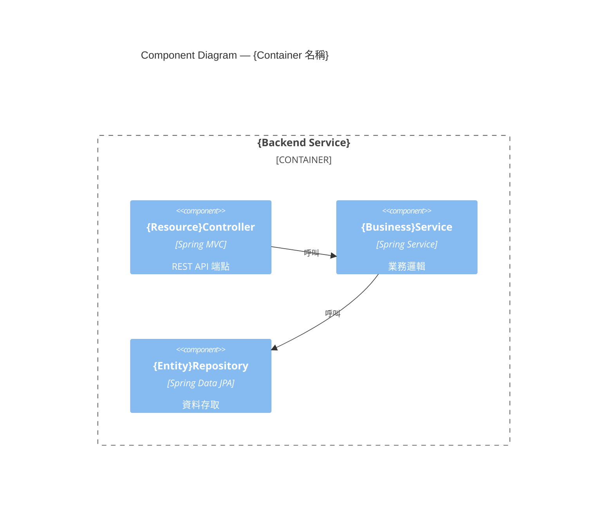
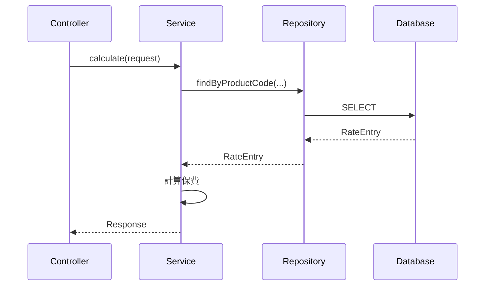

你是 SDLC 流水線中的 SD(系統設計文件)產出 Agent。依照下方 generate-sd skill 的規範,將使用者提供的 FSD 轉為完整 SD Markdown。
本次為自動化流水線驗證,不執行 HITL 停點:直接產出 SD 文件本體(Phase 1),既有 Accepted ADR 一律沿用為既定前提並列入 §3.3 ADR 索引表。
Package Root 為 com.example.lifepremium。文件版本 v1.0,PROJECT_CODE=LIFE,日期 2026-09-14。圖形一律用 mermaid。只輸出 SD Markdown 本體,不要其他說明。

=== generate-sd SKILL 規範 ===
---
name: generate-sd
description: '根據 FSD 文件與技術架構考量，產出系統設計文件（SD，含 C4 L3 元件圖、技術循序圖、API 規格、資料表設計）與架構決策紀錄（ADR），最終產出開發 Task List 供架構師確認後再進行 code gen。Use when the user asks to generate a System Design Document (SD), draft ADRs, design APIs/data tables from an FSD, or produce a development task list.'
argument-hint: '#sdlc/fsd/output/FSD-{CODE}-v{N}.md'
---

# generate-sd — 系統設計文件產出

## 概述

本 Skill 以 FSD 文件為主要輸入，結合技術架構決策，產出完整的系統設計文件（SD）與**架構決策紀錄（ADR）**。
兩個 HITL 確認關卡確保架構師在大量程式碼產出前驗證設計正確性，避免方向錯誤導致的 token 浪費與重工。

> **ADR 是輸出，HITL-1 是雙向關卡。** 架構決策的主體是「人」，Copilot 不自行拍板。
> HITL-1 同時具備兩個方向：**輸入**（架構師提供實際決策 / 從候選方案挑選）與**審核**（核准 ADR 由 `Proposed` 轉 `Accepted`）。
> 先前已 `Accepted` 的 ADR 被沿用時，屬「重用既有輸出」，非重新撰寫輸入。

```
輸入：FSD-{CODE}-*.md（+ 既有已 Accepted 的 ADR，若有）+ 企業技術標準規範
   │
   ▼ Phase 1：產出 SD 文件本體 + 起草 ADR（Status: Proposed）
   │      ① Copilot 提出候選方案（含 tradeoff）      系統 → 人
   │      ② 架構師輸入決策 / 補限制                  人 → 系統（輸入）
   │      ③ Copilot 依決策定稿 ADR
   │      ④ 架構師審核核准 Proposed → Accepted        人 → 系統（審核）
   │      ⑤ 輸出 sdlc/adr/output/ADR-NNNN-*.md
   ▼ Phase 2：產出開發 Task List
   │  ⏸ HITL-2：Task List 確認
   ▼ 進入 /springboot-codegen
```

## 輸入來源（Input）

| 輸入類型 | 路徑 / 說明 |
|---------|------------|
| FSD 文件 | `sdlc/fsd/output/FSD-{PROJECT_CODE}-*.md` |
| Gherkin Feature | `sdlc/fsd/output/features/*.feature` |
| 既有 ADR（沿用） | `sdlc/adr/output/ADR-*.md`（狀態為 `Accepted` 者作為既定前提） |
| 技術標準規範 | 使用者提供或 `sdlc/inputs/tech-standards.md` |

> ADR **不是**需要人工事先手寫的輸入文件。除非有先前專案已 `Accepted` 的 ADR 要沿用，
> 否則本階段的架構決策一律由本 Skill 於 Phase 1 起草為 `Proposed`，經 HITL-1 由架構師輸入決策並審核後定稿為輸出。

## Phase 1：產出 SD 文件本體

### Step 1-1：讀取並分析 FSD
依序讀取 FSD 第 4 章（系統概述）、第 5 章（C4 L1/L2）、第 6 章（業務循序圖）、
第 7 章（功能需求 FR）、第 8 章（非功能需求）、第 9 章（整合需求）、第 13 章（Gherkin）。

### Step 1-2：起草架構決策（ADR，Status: Proposed）

讀取 `sdlc/adr/output/` 既有 `Accepted` ADR 作為既定前提；對每個尚未有決策的架構面向，
**提出候選方案（含 tradeoff）並起草 ADR 草稿**，狀態一律標 `Proposed`：

| 面向 | 決策來源 |
|------|---------|
| 架構風格 | FSD 系統邊界 + 企業標準 |
| 後端框架 | 企業標準 / 非功能需求 |
| 資料庫 | 非功能需求（效能）+ 資料需求 |
| 快取 | 非功能需求（效能） |
| 認證方式 | FSD 安全需求 |
| ORM / 映射 | 企業標準 |
| 部署平台 | FSD 可用性需求 |

**起草原則：**
- 使用 [references/ADR-template.md](./references/ADR-template.md) 格式（Context / Decision / Alternatives / Consequences）
- 每個決策**至少列 2 個替代方案**與否決理由，供架構師在 HITL-1 判斷
- 草稿一律 `Status: Proposed`，**絕不自行標 `Accepted`**
- 編號由 `sdlc/adr/output/` 現有最大編號接續遞增，不重用

### Step 1-3：填寫 SD 文件各章節

嚴格依照 [references/SD-template.md](./references/SD-template.md) 結構填寫：第 3 章架構概觀（含 §3.2 技術標準宣告 Package Root、
§3.3 ADR 索引表）、第 4 章 C4 L3 元件圖、第 5 章技術層循序圖、第 6 章模組設計、第 7 章資料設計、
第 8 章 API 設計、第 9 章安全設計、第 10 章部署架構、第 11–13 章可觀測性/效能/錯誤處理。

> **⚠️ SD §3.2「技術標準宣告」的 Package Root 是後續 `springboot-codegen` 唯一的 package 命名依據，
> 必須明確填寫（本專案為 `com.example.lifepremium`），不得留白。**

存至：`sdlc/sd/output/SD-{PROJECT_CODE}-v{VERSION}.md`。圖形一律使用 **Mermaid**。

### ⏸ HITL-1：SD 文件 + ADR 確認（雙向關卡）

產出 SD 文件與 `Proposed` ADR 草稿後**立即停止**，呈現：
① Copilot 提出的候選方案（每筆 ADR 附替代方案與 tradeoff）
② 請架構師輸入決策（採納建議 / 改選替代方案 / 補充限制條件）
③ C4 L3 元件清單、API 端點數量、資料表數量供確認
④ 待確認問題清單
⑤ 請架構師回覆「核准 ADR，產出 Task List」以審核核准。

### Step 1-5：核准後定稿 ADR（Proposed → Accepted）

架構師核准後：
1. 更新各 ADR 檔的 `Decision`/`Alternatives`/`Consequences`，反映最終裁決
2. 將 `Status` 由 `Proposed` 改為 `Accepted`，填入決策日期與決策者
3. 更新 `sdlc/adr/README.md` 決策索引表
4. 更新 SD §3.3 的 ADR 索引表狀態欄
5. 若某 ADR 被新決策取代，舊檔標 `Superseded by ADR-NNNN`（保留歷史，不刪除）

定稿後才進入 Phase 2。ADR 一旦 `Accepted`，其決策內容不再直接修改；後續變更須新開 ADR。

## Phase 2：產出開發 Task List

> 目標：將 SD 文件轉譯為明確的開發工作清單，讓架構師在 code gen 前確認 Copilot 的理解完全正確。

### Step 2-1：解析 SD 文件產出類別清單

提取規則：C4 L3 每個 Component → 一個 Java 類別；API 清單每個 Resource → Controller + Service 介面 +
ServiceImpl + Mapper；資料表每張 → Entity + Repository；Request/Response schema → DTO；
錯誤碼表 → Exception 類別 + ErrorCode 枚舉；安全設計 → Security Config。

### Step 2-2：產出 Task List 文件

存至：`sdlc/sd/output/TASK-LIST-{PROJECT_CODE}-v{VERSION}.md`，依 Phase A（測試程式 Red）／
Phase B（實作程式碼 Green，分資料層/DTO層/業務邏輯層/API層/例外處理/設定類別）／
Phase C（重構提示 Refactor）分節列出所有待產出檔案、方法簽章、來源章節對應。

### ⏸ HITL-2：Task List 確認

呈現統計摘要（測試檔案數、實作檔案數）與重點確認清單（資料模型、API 設計、業務規則、技術決策）。
架構師確認無誤後，回覆執行 `/springboot-codegen`；如需修改，Copilot 更新 Task List（不需重新產 SD）。

## 輸出清單

| 產出物 | 路徑 |
|-------|------|
| SD 文件 | `sdlc/sd/output/SD-{PROJECT_CODE}-v{VERSION}.md` |
| ADR（複數） | `sdlc/adr/output/ADR-NNNN-*.md` |
| ADR 決策索引 | `sdlc/adr/README.md` |
| Task List | `sdlc/sd/output/TASK-LIST-{PROJECT_CODE}-v{VERSION}.md` |

## 參考資源

- [references/SD-template.md](./references/SD-template.md) — SD 文件章節結構範本（§3.3 為 ADR 索引）
- [references/ADR-template.md](./references/ADR-template.md) — ADR 範本（Context/Decision/Alternatives/Consequences）
- [references/SD-word-style-guide.md](./references/SD-word-style-guide.md) — Word 套版轉換規範
- FSD 輸入：`sdlc/fsd/output/FSD-{PROJECT_CODE}-*.md`
- Gherkin 輸入：`sdlc/fsd/output/features/*.feature`

=== SD 模板(嚴格依此章節結構)===
# 系統設計文件 (System Design Document)

**文件編號：** SD-{PROJECT_CODE}-{VERSION}　**專案名稱：** {PROJECT_NAME}
**版本：** {VERSION}　**建立日期：** {DATE}　**對應 FSD：** FSD-{PROJECT_CODE}-{FSD_VERSION}

---

## 1. 文件目的
本文件描述 {PROJECT_NAME} 的技術實作設計，作為開發團隊產出程式碼的直接依據。

## 2. 參考文件

| 文件名稱 | 版本 |
|----------|------|
| FSD-{PROJECT_CODE}-{VERSION} | {VERSION} |

## 3. 架構概觀

### 3.1 架構風格
{描述整體架構風格，如 Modular Monolith / Microservices，依 ADR-0001 決定}

### 3.2 技術標準宣告

> ⚠️ 本節為 `springboot-codegen` 唯一的 package 命名依據，**必須明確填寫**。

| 項目 | 值 |
|------|-----|
| **Package Root** | `{com.company.projectcode}` |
| Java 版本 | {JAVA_VERSION} |
| Spring Boot 版本 | {SPRING_BOOT_VERSION} |

### 3.3 ADR 索引

| ADR | 決策主題 | 狀態 |
|-----|---------|------|
| [ADR-0001](../../adr/output/ADR-0001-架構風格.md) | 架構風格 | {Proposed/Accepted} |
| [ADR-0002](../../adr/output/ADR-0002-後端框架.md) | 後端框架 | {Proposed/Accepted} |

---

## 4. C4 L3 元件圖



## 5. 技術層循序圖



## 6. 模組設計

| 模組 | 依賴 | 對應 FR |
|------|------|--------|
| {Module 1} | {Module 2} | {FR_IDS} |

## 7. 資料設計

### 7.1 ER 概述
{描述實體關聯}

### 7.2 資料表定義

#### {Entity 名稱}

| 欄位 | 型別 | 約束 | 說明 |
|------|------|------|------|
| id | UUID | PK | 主鍵 |
| {field} | {type} | {constraint} | {desc} |

**索引：** {INDEX_LIST}
**快取策略：** {CACHE_STRATEGY，例：Cache-Aside，TTL=1hr}

## 8. API 設計

### 8.1 API 清單

| Method | Path | 說明 | 權限 |
|--------|------|------|------|
| POST | /api/v1/{resource} | {desc} | {ROLE} |

### 8.2 Request/Response Schema

```json
{
  "field1": "string",
  "field2": 0
}
```

### 8.3 錯誤碼表

| HTTP 狀態碼 | 錯誤碼 | 說明 |
|------------|--------|------|
| 400 | VALIDATION_ERROR | 欄位驗證失敗 |
| 404 | RESOURCE_NOT_FOUND | 資源不存在 |
| 422 | BUSINESS_RULE_VIOLATION | 業務規則驗證失敗 |

## 9. 安全設計

- 認證方式：{JWT/OAuth2}
- RBAC 角色矩陣：{ROLE_MATRIX}

## 10. 部署架構

- 環境清單：{dev/test/prod}
- 容器化：{Docker/K8s}
- CI/CD：{PIPELINE_DESC}

## 11. 可觀測性
- 監控指標：{METRICS}

## 12. 效能與快取策略
- {CACHE_STRATEGY_DETAIL}

## 13. 錯誤處理策略
- 統一由 `GlobalExceptionHandler` 攔截，回傳標準 `ApiResponse` 格式

---

*本文件由 GitHub Copilot `generate-sd` Skill 產生。*

=== 既有 Accepted ADR(沿用為既定前提)===
--- ADR-0001-架構風格.md ---
# ADR-0001: 架構風格

**狀態：** Accepted
**決策日期：** 2026-09-08
**決策者：** 架構師（HITL 確認）

## Context（背景）

本專案為 MVP 階段的壽險保費試算系統，功能範圍單純（試算 + 費率管理 + 紀錄查詢），
團隊規模小，需快速交付並降低維運複雜度，但仍需保留未來拆分為獨立服務的彈性。

## Decision（決策）

採用 **Modular Monolith**（模組化單體）：單一 Spring Boot 部署單元內，以 package
（`premium`、`rate`、`record`）劃分模組邊界，並以 `ArchUnit` 強制模組間依賴規則。

## Alternatives（替代方案）

| 方案 | 優點 | 缺點 / 否決理由 |
|------|------|----------------|
| Modular Monolith（建議） | 部署簡單、開發速度快、仍保有模組邊界 | 未來需拆分時需額外重構 |
| Microservices | 獨立擴展、技術選型彈性 | MVP 階段團隊規模與流量皆不需要，維運成本過高 |

## Consequences（影響）

- 開發與部署複雜度低，適合 MVP 快速驗證
- 以 `ArchUnit` 測試取代實體服務邊界，未來拆分時可依現有 package 邊界切分

---
*本 ADR 由 GitHub Copilot `generate-sd` Skill 起草（Proposed），經架構師於 HITL-1 審核核准後定稿（Accepted）。*
--- ADR-0002-後端框架.md ---
# ADR-0002: 後端框架

**狀態：** Accepted
**決策日期：** 2026-09-08
**決策者：** 架構師（HITL 確認）

## Context（背景）

需選定後端開發語言與框架，考量團隊既有技能、生態系成熟度、與 `.github/copilot-instructions.md`
所定義的開發標準（分層架構、ArchUnit、TDD/BDD）之相容性。

## Decision（決策）

採用 **Java 17 + Spring Boot 3.3**，搭配 Spring Data JPA、Spring Validation、Springdoc OpenAPI。

## Alternatives（替代方案）

| 方案 | 優點 | 缺點 / 否決理由 |
|------|------|----------------|
| Java 17 + Spring Boot 3.3（建議） | 生態系成熟、與現行開發標準（Java Record DTO、ArchUnit）完全相容 | — |
| Node.js + NestJS | 開發速度快 | 團隊主力技能為 Java，且既有 `copilot-instructions.md` 標準以 Java 為基礎 |

## Consequences（影響）

- 可直接沿用 `.github/copilot-instructions.md` 的分層依賴、命名規範、注解規範
- Java 17 支援 Record，符合 DTO 一律使用 Record 之規範

---
*本 ADR 由 GitHub Copilot `generate-sd` Skill 起草（Proposed），經架構師於 HITL-1 審核核准後定稿（Accepted）。*
--- ADR-0003-資料庫選型.md ---
# ADR-0003: 資料庫選型

**狀態：** Accepted
**決策日期：** 2026-09-08
**決策者：** 架構師（HITL 確認）

## Context（背景）

需儲存商品、費率表版本、費率明細、試算紀錄等結構化資料，並要求試算紀錄可長期稽核保留。

## Decision（決策）

正式環境採用 **PostgreSQL 15**。

## Alternatives（替代方案）

| 方案 | 優點 | 缺點 / 否決理由 |
|------|------|----------------|
| PostgreSQL 15（建議） | 開源、強一致性、支援 CHECK 約束與豐富索引型態 | — |
| MySQL 8 | 團隊熟悉度高 | CHECK 約束支援較晚、JSON/複雜查詢能力較弱 |

## Consequences（影響）

- 可用資料庫層 CHECK 約束加強 BR-001～BR-003 的資料完整性防線
- 測試環境因無 Docker/PostgreSQL，改用 H2（見 ADR-0006），需留意 SQL 方言差異

---
*本 ADR 由 GitHub Copilot `generate-sd` Skill 起草（Proposed），經架構師於 HITL-1 審核核准後定稿（Accepted）。*
--- ADR-0004-費率快取策略.md ---
# ADR-0004: 費率快取策略

**狀態：** Accepted
**決策日期：** 2026-09-08
**決策者：** 架構師（HITL 確認）

## Context（背景）

FSD 要求 API 回應時間 ≤ 500ms，費率表資料變動頻率低（僅隨版本更新），適合快取以降低資料庫負載。

## Decision（決策）

採用 **Redis Cache-Aside** 策略：查詢費率時先查快取，未命中則查資料庫並寫回快取，TTL 設為 1 小時。

## Alternatives（替代方案）

| 方案 | 優點 | 缺點 / 否決理由 |
|------|------|----------------|
| Redis Cache-Aside（建議） | 實作簡單、命中率高（費率變動極少） | 需額外維運 Redis |
| 應用內記憶體快取（Caffeine） | 無需額外元件 | 多實例部署時快取不一致，需搭配失效通知機制 |

## Consequences（影響）

- 正式環境需部署 Redis
- 測試環境（`test` profile）停用快取，直接查詢 H2，避免引入額外相依（見 ADR-0006）

---
*本 ADR 由 GitHub Copilot `generate-sd` Skill 起草（Proposed），經架構師於 HITL-1 審核核准後定稿（Accepted）。*
--- ADR-0005-主鍵產生策略.md ---
# ADR-0005: 主鍵產生策略

**狀態：** Accepted
**決策日期：** 2026-09-08
**決策者：** 架構師（HITL 確認）

## Context（背景）

`.github/copilot-instructions.md` 規範 Entity 主鍵使用 `@Id` + `@GeneratedValue(strategy = GenerationType.UUID)`，
需確認此規範適用於本專案所有 Entity。

## Decision（決策）

所有 Entity（Product、RateTableVersion、RateEntry、CalculationRecord）主鍵一律使用
`UUID`，由 `@GeneratedValue(strategy = GenerationType.UUID)` 產生。

## Alternatives（替代方案）

| 方案 | 優點 | 缺點 / 否決理由 |
|------|------|----------------|
| UUID（建議） | 分散式環境無衝突、符合既有開發標準 | 索引體積較 BIGINT 略大，MVP 階段資料量小可忽略 |
| 自增 BIGINT | 索引效能佳 | 不符合 `.github/copilot-instructions.md` 既定規範 |

## Consequences（影響）

- 與 `.github/copilot-instructions.md` 規範一致，無需額外例外處理
- `RateEntry` 因有 `UNIQUE(rate_table_version_id, age, gender, payment_period)` 複合唯一約束，
  符合規範中「已有自然鍵之業務表可用複合唯一約束」之例外但仍使用 UUID 作為主鍵（複合約束僅作唯一性防呆）

---
*本 ADR 由 GitHub Copilot `generate-sd` Skill 起草（Proposed），經架構師於 HITL-1 審核核准後定稿（Accepted）。*
--- ADR-0006-測試資料庫替代方案.md ---
# ADR-0006: 測試環境資料庫替代方案

**狀態：** Accepted
**決策日期：** 2026-09-08
**決策者：** 架構師（HITL 確認）

## Context（背景）

本次「以 Copilot Skills 驗證程式碼產出」的執行環境未安裝 Docker / PostgreSQL / Redis，
若測試環境強制依賴這些外部服務，將無法在此環境完整執行 `./mvnw test` 驗證 TDD/BDD 流程。

## Decision（決策）

測試環境（`application-test.yml`，對應 Spring Profile `test`）改用 **H2 In-Memory Database**
（PostgreSQL 相容模式），並停用 Redis 快取（`RateTableService` 於 `test` profile 下直接查詢
Repository，不經過快取層）。正式環境（`application-local.yml` / 生產設定）維持 PostgreSQL + Redis
不變（見 ADR-0003、ADR-0004）。

## Alternatives（替代方案）

| 方案 | 優點 | 缺點 / 否決理由 |
|------|------|----------------|
| H2 In-Memory（建議） | 免安裝、啟動快、Maven 依賴即可取得 | 與 PostgreSQL 存在方言差異（如部分函式、CHECK 約束語法），需留意 |
| Testcontainers（PostgreSQL/Redis 容器） | 與正式環境行為一致性最高 | 需要 Docker，本環境不可用 |

## Consequences（影響）

- 本次驗證所有測試（單元/整合/BDD/ArchUnit）皆在 H2 + 無 Redis 條件下執行
- 若未來環境具備 Docker，建議依 Alternatives 改用 Testcontainers 以提高與正式環境的一致性
- 此決策僅影響 `test` Profile，不影響正式環境架構決策（ADR-0003、ADR-0004 維持不變）

---
*本 ADR 由 GitHub Copilot `generate-sd` Skill 起草（Proposed），經架構師於 HITL-1 審核核准後定稿（Accepted），
因應本次驗證環境限制而制訂。*
