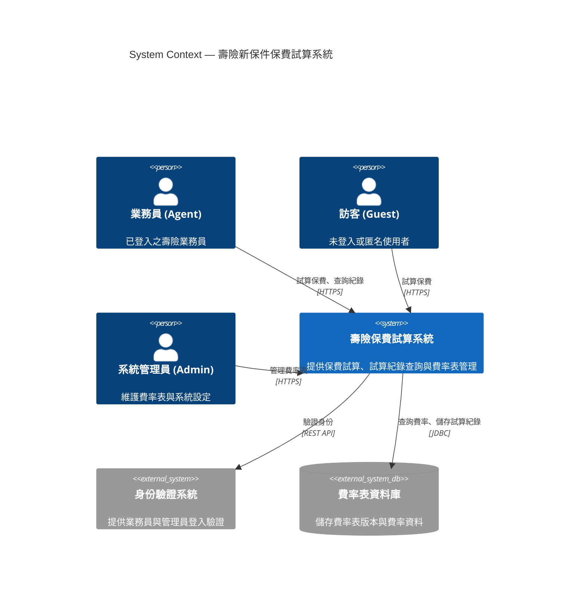
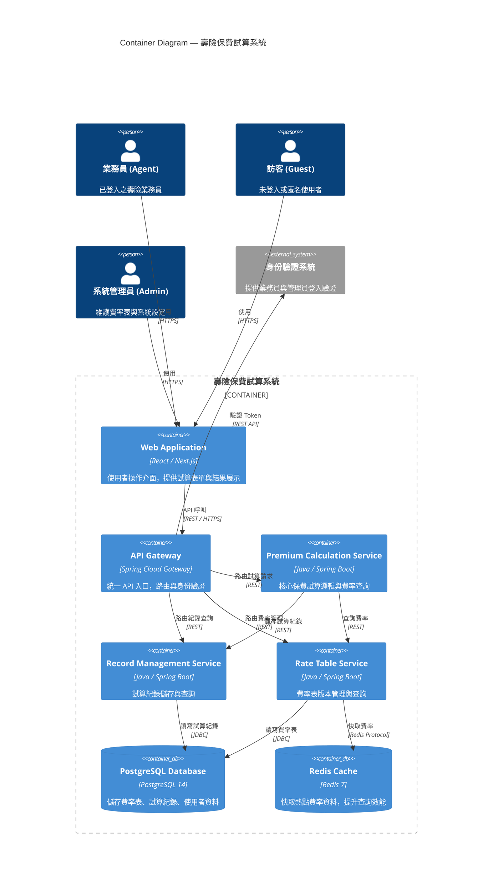
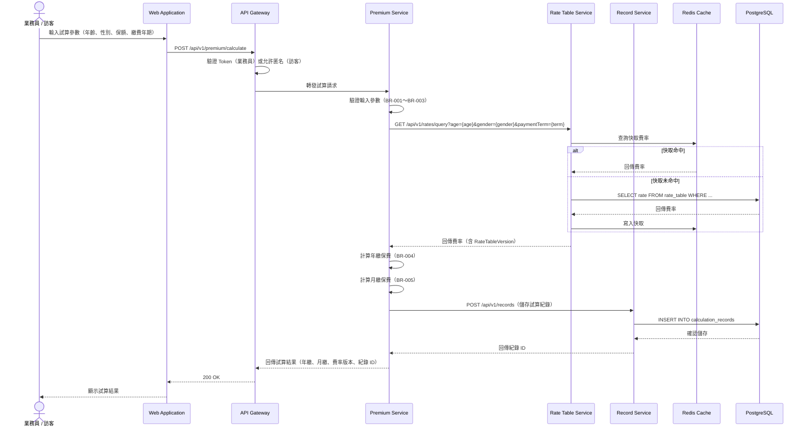
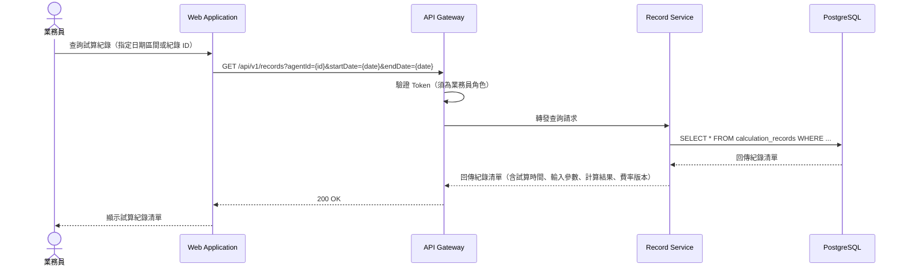
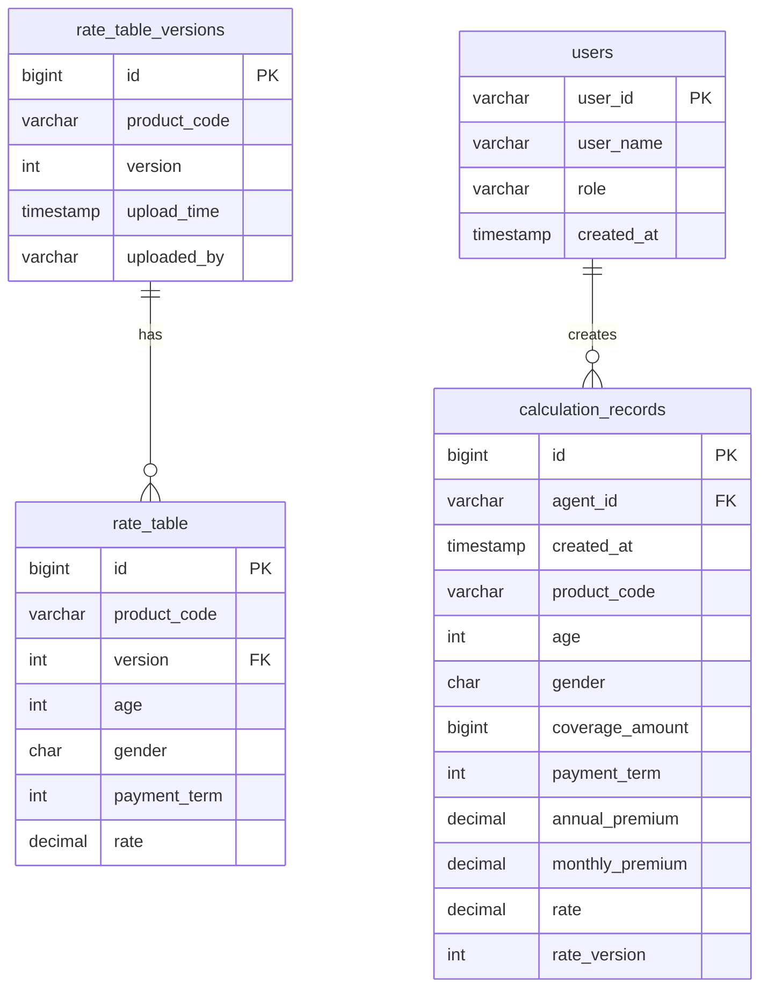

以下為 FSD 文件,請據此產出 SD:

# 功能規格文件 (Functional Specification Document)

**文件編號：** FSD-LIFE-v1.0
**專案名稱：** 壽險新保件保費試算系統 (Life Premium Calculator)
**版本：** v1.0　**建立日期：** 2026-09-14　**最後更新：** 2026-09-14
**文件狀態：** 核准

---

## 文件修訂紀錄

| 版本 | 日期 | 修訂人 | 修訂說明 |
|------|------|--------|----------|
| 1.0  | 2026-09-14 | GitHub Copilot Agent | 初版建立，依需求文件 LIFE-PREMIUM v1.0 產出 |

---

## 1. 文件目的與範圍

### 1.1 目的
本文件旨在描述 **壽險新保件保費試算系統 (Life Premium Calculator)** 的功能需求，作為開發、測試與業務單位之間的溝通基礎。系統提供業務員與訪客即時試算壽險保費，協助投保決策並保留試算紀錄供稽核。

### 1.2 範圍
- 支援業務員登入後為客戶試算保費，並保留試算紀錄
- 支援訪客於官網公開頁面試算保費（匿名或不留紀錄）
- 依被保人年齡、性別、保額、繳費年期查詢費率表，計算年繳與月繳保費
- 支援費率表版本管理，確保歷史試算紀錄可追溯對應費率版本
- 提供試算紀錄查詢與稽核功能

### 1.3 不在範圍內
- 保單核保流程（Underwriting）
- 保單簽發與繳費收款
- 客戶關係管理（CRM）整合
- 多商品組合試算（本版本僅支援單一商品 LIFE-WL-01）
- 行動裝置原生 App（本版本僅提供 Web 介面）

---

## 2. 名詞定義與縮寫

| 名詞 / 縮寫 | 說明 |
|------------|------|
| FSD | Functional Specification Document，功能規格文件 |
| LIFE | 專案代碼，壽險新保件保費試算系統 |
| BR | Business Rule，業務規則 |
| FR | Functional Requirement，功能需求 |
| 被保人 | 保險契約中受保障之人 |
| 年繳保費 | 每年繳納一次之保險費 |
| 月繳保費 | 每月繳納一次之保險費（年繳 ÷ 12 × 1.03） |
| 費率表 | 依商品、年齡、性別、繳費年期查詢之每千元保額費率 |
| RateTableVersion | 費率表版本號，用於追溯歷史試算所依據之費率 |
| Agent | 業務員角色 |
| Guest | 訪客角色（未登入或匿名） |

---

## 3. 參考文件

| 文件名稱 | 版本 | 說明 |
|----------|------|------|
| 需求文件：壽險新保件保費試算（Life Premium） | v1.0 | 業務需求來源，文件代碼 LIFE-PREMIUM |
| 費率表規格文件 | v1 | 商品 LIFE-WL-01 費率表結構與查詢邏輯 |

---

## 4. 系統概述

### 4.1 系統背景
壽險業務員於銷售過程中需即時為客戶試算保費，協助客戶評估投保方案。現有試算流程依賴人工查表或 Excel 試算，效率低且易出錯。本系統提供 Web 介面，自動化費率查詢與保費計算，並保留試算紀錄供稽核與業務分析。

### 4.2 系統目標
1. 提供業務員與訪客即時、準確的保費試算服務
2. 自動化費率查詢與保費計算，減少人工錯誤
3. 保留試算紀錄（含業務員 ID、試算時間、輸入參數、計算結果、費率版本），支援稽核與業務分析
4. 支援費率表版本管理，確保歷史試算紀錄可追溯對應費率版本
5. API 回應時間 ≤ 500ms，提升使用者體驗

### 4.3 使用者族群

| 使用者角色 | 說明 | 主要使用功能 |
|-----------|------|-------------|
| 業務員（Agent） | 已登入之壽險業務員，為客戶試算保費 | 保費試算、試算紀錄查詢 |
| 訪客（Guest） | 未登入或匿名使用者，於官網公開頁面試算保費 | 保費試算（不留紀錄或以匿名代理人記錄） |
| 系統管理員（Admin） | 維護費率表版本與系統設定 | 費率表上傳、版本管理、試算紀錄稽核 |

---

## 5. 系統架構圖（C4 Model）

### 5.1 C4 L1 — System Context Diagram



### 5.2 C4 L2 — Container Diagram



**Container 清單：**

| Container | 技術選型 | 職責 |
|-----------|---------|------|
| Web Application | React / Next.js | 使用者操作介面，提供試算表單與結果展示 |
| API Gateway | Spring Cloud Gateway | 統一 API 入口，路由與身份驗證 |
| Premium Calculation Service | Java / Spring Boot | 核心保費試算邏輯與費率查詢 |
| Record Management Service | Java / Spring Boot | 試算紀錄儲存與查詢 |
| Rate Table Service | Java / Spring Boot | 費率表版本管理與查詢 |
| PostgreSQL Database | PostgreSQL 14 | 儲存費率表、試算紀錄、使用者資料 |
| Redis Cache | Redis 7 | 快取熱點費率資料，提升查詢效能 |

---

## 6. 業務流程循序圖

### 6.1 保費試算流程（對應 FR-PREMIUM-001）



**例外情境：**
- **年齡超出 0～70 歲** → Premium Service 回傳 422 Unprocessable Entity，錯誤訊息：「被保人年齡須介於 0～70 歲」
- **保額超出 100～5,000 萬元** → Premium Service 回傳 422，錯誤訊息：「保額須介於 100～5,000 萬元」
- **繳費年期不在 {10,20,30,99}** → Premium Service 回傳 422，錯誤訊息：「繳費年期須為 10 / 20 / 30 / 99 年」
- **查無對應費率** → Rate Service 回傳 404 Not Found，Premium Service 回傳 422，錯誤訊息：「查無對應費率，請聯絡系統管理員」

### 6.2 試算紀錄查詢流程（對應 FR-RECORD-001）



**例外情境：**
- **未登入或非業務員角色** → Gateway 回傳 401 Unauthorized，錯誤訊息：「請先登入」
- **查詢日期區間超過 90 天** → Record Service 回傳 422，錯誤訊息：「查詢區間不可超過 90 天」

---

## 7. 功能需求

### 7.1 保費試算模組（PREMIUM）

#### FR-PREMIUM-001：保費試算

- **優先等級：** 高
- **需求來源：** 需求文件 LIFE-PREMIUM v1.0
- **功能描述：** 使用者（業務員或訪客）輸入被保人基本資料（年齡、性別、保額、繳費年期），系統即時計算年繳與月繳保費，並回傳費率版本與試算紀錄 ID（業務員）。
- **前置條件：** 
  - 系統已載入費率表版本 v1（商品 LIFE-WL-01）
  - 業務員已登入（若為業務員角色）
- **主要流程：**
  1. 使用者於 Web 介面輸入試算參數：年齡（0～70）、性別（M / F）、保額（100～5,000 萬元）、繳費年期（10 / 20 / 30 / 99 年）
  2. 系統驗證輸入參數（BR-001～BR-003）
  3. 系統查詢費率表（依年齡、性別、繳費年期、商品代碼 LIFE-WL-01、最新費率版本）
  4. 系統計算年繳保費：ROUND(保額 ÷ 1000 × 費率)（BR-004）
  5. 系統計算月繳保費：ROUND(年繳 ÷ 12 × 1.03)（BR-005）
  6. 若為業務員角色，系統儲存試算紀錄（含業務員 ID、試算時間、輸入參數、計算結果、費率版本）
  7. 系統回傳試算結果：年繳保費、月繳保費、費率版本、試算紀錄 ID（業務員）
- **替代流程：** 
  - 若為訪客角色，系統不儲存試算紀錄（或以匿名代理人 ID 記錄，供統計分析用）
- **例外處理：** 
  - 若年齡超出 0～70 歲，系統回傳 422，錯誤訊息：「被保人年齡須介於 0～70 歲」
  - 若保額超出 100～5,000 萬元，系統回傳 422，錯誤訊息：「保額須介於 100～5,000 萬元」
  - 若繳費年期不在 {10,20,30,99}，系統回傳 422，錯誤訊息：「繳費年期須為 10 / 20 / 30 / 99 年」
  - 若查無對應費率（年齡/性別/繳費年期組合未建檔），系統回傳 422，錯誤訊息：「查無對應費率，請聯絡系統管理員」
- **驗收標準：**
  - [ ] 輸入年齡 35、性別 M、保額 1,000 萬元、繳費年期 20 年，系統回傳年繳保費 125,000 元、月繳保費 10,729 元
  - [ ] 輸入年齡 71，系統回傳錯誤訊息「被保人年齡須介於 0～70 歲」
  - [ ] 輸入保額 99 萬元，系統回傳錯誤訊息「保額須介於 100～5,000 萬元」
  - [ ] 輸入繳費年期 15 年，系統回傳錯誤訊息「繳費年期須為 10 / 20 / 30 / 99 年」
  - [ ] 查無對應費率時，系統回傳錯誤訊息「查無對應費率，請聯絡系統管理員」
  - [ ] 業務員試算後，系統儲存試算紀錄（含業務員 ID、試算時間、輸入參數、計算結果、費率版本）
  - [ ] 訪客試算後，系統不儲存試算紀錄（或以匿名代理人 ID 記錄）
  - [ ] API 回應時間 ≤ 500ms（P95）

#### FR-PREMIUM-002：費率查詢

- **優先等級：** 高
- **需求來源：** 需求文件 LIFE-PREMIUM v1.0
- **功能描述：** 系統依年齡、性別、繳費年期、商品代碼、費率版本查詢費率表，回傳每千元保額費率。
- **前置條件：** 
  - 費率表已載入至資料庫
  - 費率表版本已指定（預設為最新版本）
- **主要流程：**
  1. Premium Service 呼叫 Rate Table Service API：GET /api/v1/rates/query?productCode=LIFE-WL-01&age={age}&gender={gender}&paymentTerm={term}&version={version}
  2. Rate Table Service 先查詢 Redis Cache
  3. 若快取未命中，查詢 PostgreSQL rate_table 表
  4. 回傳費率（每千元保額費率）與費率版本
  5. 若查詢結果寫入 Redis Cache（TTL 1 小時）
- **替代流程：** 
  - 若未指定費率版本，系統自動使用最新版本
- **例外處理：** 
  - 若查無對應費率，回傳 404 Not Found
- **驗收標準：**
  - [ ] 查詢年齡 35、性別 M、繳費年期 20 年，系統回傳費率 12.50
  - [ ] 查詢年齡 35、性別 F、繳費年期 20 年，系統回傳費率 11.20
  - [ ] 查詢不存在的年齡/性別/繳費年期組合，系統回傳 404
  - [ ] 快取命中時，查詢回應時間 ≤ 50ms
  - [ ] 快取未命中時，查詢回應時間 ≤ 200ms

### 7.2 試算紀錄管理模組（RECORD）

#### FR-RECORD-001：試算紀錄查詢

- **優先等級：** 中
- **需求來源：** 需求文件 LIFE-PREMIUM v1.0
- **功能描述：** 業務員查詢自己的試算紀錄，支援依日期區間、紀錄 ID 篩選。
- **前置條件：** 
  - 業務員已登入
  - 試算紀錄已儲存至資料庫
- **主要流程：**
  1. 業務員於 Web 介面選擇查詢條件：日期區間（起訖日期）或紀錄 ID
  2. 系統驗證 Token，確認為業務員角色
  3. 系統查詢 calculation_records 表（WHERE agent_id = {業務員 ID} AND created_at BETWEEN {startDate} AND {endDate}）
  4. 系統回傳紀錄清單（含試算時間、輸入參數、計算結果、費率版本）
- **替代流程：** 
  - 若查詢紀錄 ID，系統直接查詢單筆紀錄（WHERE record_id = {id} AND agent_id = {業務員 ID}）
- **例外處理：** 
  - 若未登入或非業務員角色，系統回傳 401 Unauthorized
  - 若查詢日期區間超過 90 天，系統回傳 422，錯誤訊息：「查詢區間不可超過 90 天」
  - 若查詢紀錄 ID 不存在或不屬於該業務員，系統回傳 404 Not Found
- **驗收標準：**
  - [ ] 業務員查詢 2026-09-01～2026-09-14 的試算紀錄，系統回傳該期間所有紀錄
  - [ ] 業務員查詢特定紀錄 ID，系統回傳該筆紀錄詳細資料
  - [ ] 未登入使用者查詢紀錄，系統回傳 401
  - [ ] 查詢日期區間超過 90 天，系統回傳 422
  - [ ] 查詢不存在的紀錄 ID，系統回傳 404

#### FR-RECORD-002：試算紀錄儲存

- **優先等級：** 高
- **需求來源：** 需求文件 LIFE-PREMIUM v1.0
- **功能描述：** 業務員試算保費後，系統自動儲存試算紀錄（含業務員 ID、試算時間、輸入參數、計算結果、費率版本），供稽核與業務分析。
- **前置條件：** 
  - 業務員已登入
  - 試算成功（已取得年繳與月繳保費）
- **主要流程：**
  1. Premium Service 呼叫 Record Service API：POST /api/v1/records
  2. Request Body 包含：業務員 ID、試算時間、商品代碼、年齡、性別、保額、繳費年期、年繳保費、月繳保費、費率、費率版本
  3. Record Service 寫入 calculation_records 表
  4. 回傳紀錄 ID
- **替代流程：** 
  - 若為訪客角色，系統不儲存紀錄（或以匿名代理人 ID 記錄，agent_id = 'GUEST'）
- **例外處理：** 
  - 若資料庫寫入失敗，系統回傳 500 Internal Server Error，但不影響試算結果回傳（試算結果優先）
- **驗收標準：**
  - [ ] 業務員試算後，系統儲存紀錄至 calculation_records 表
  - [ ] 紀錄包含：業務員 ID、試算時間、商品代碼、年齡、性別、保額、繳費年期、年繳保費、月繳保費、費率、費率版本
  - [ ] 訪客試算後，系統不儲存紀錄（或以 agent_id = 'GUEST' 記錄）
  - [ ] 資料庫寫入失敗時，系統仍回傳試算結果（不阻斷使用者操作）

### 7.3 費率表管理模組（RATE）

#### FR-RATE-001：費率表版本管理

- **優先等級：** 中
- **需求來源：** 需求文件 LIFE-PREMIUM v1.0
- **功能描述：** 系統管理員上傳新版費率表，系統自動產生版本號（v1, v2, ...），不覆蓋歷史版本，確保歷史試算紀錄可追溯對應費率版本。
- **前置條件：** 
  - 系統管理員已登入
  - 費率表檔案格式為 CSV（欄位：商品代碼、年齡、性別、繳費年期、費率）
- **主要流程：**
  1. 系統管理員於 Web 介面上傳費率表 CSV 檔
  2. 系統驗證 Token，確認為管理員角色
  3. 系統解析 CSV 檔，驗證欄位格式與資料完整性
  4. 系統查詢目前最新版本號（SELECT MAX(version) FROM rate_table_versions WHERE product_code = 'LIFE-WL-01'）
  5. 系統產生新版本號（version = 最新版本 + 1）
  6. 系統寫入 rate_table_versions 表（product_code, version, upload_time, uploaded_by）
  7. 系統寫入 rate_table 表（product_code, version, age, gender, payment_term, rate）
  8. 系統清除 Redis Cache 中該商品的所有費率快取
  9. 系統回傳上傳成功訊息與新版本號
- **替代流程：** 
  - 若 CSV 檔格式錯誤，系統回傳 422，錯誤訊息：「費率表格式錯誤，請檢查欄位」
- **例外處理：** 
  - 若 CSV 檔包含重複的年齡/性別/繳費年期組合，系統回傳 422，錯誤訊息：「費率表包含重複資料」
  - 若資料庫寫入失敗，系統回傳 500，並 Rollback 交易
- **驗收標準：**
  - [ ] 管理員上傳費率表 CSV 檔，系統產生新版本號（v2）
  - [ ] 系統寫入 rate_table_versions 與 rate_table 表
  - [ ] 系統清除 Redis Cache 中該商品的所有費率快取
  - [ ] 歷史版本（v1）費率資料不受影響
  - [ ] CSV 檔格式錯誤時，系統回傳 422
  - [ ] CSV 檔包含重複資料時，系統回傳 422

#### FR-RATE-002：費率表查詢（內部 API）

- **優先等級：** 高
- **需求來源：** 需求文件 LIFE-PREMIUM v1.0
- **功能描述：** 提供內部 API 供 Premium Service 查詢費率，支援指定版本或預設最新版本。
- **前置條件：** 
  - 費率表已載入至資料庫
- **主要流程：**
  1. Premium Service 呼叫 Rate Table Service API：GET /api/v1/rates/query?productCode=LIFE-WL-01&age={age}&gender={gender}&paymentTerm={term}&version={version}
  2. Rate Table Service 先查詢 Redis Cache（Key: rate:{productCode}:{version}:{age}:{gender}:{paymentTerm}）
  3. 若快取命中，直接回傳費率
  4. 若快取未命中，查詢 PostgreSQL rate_table 表（WHERE product_code = {productCode} AND version = {version} AND age = {age} AND gender = {gender} AND payment_term = {paymentTerm}）
  5. 若查詢結果寫入 Redis Cache（TTL 1 小時）
  6. 回傳費率與費率版本
- **替代流程：** 
  - 若未指定版本，系統自動查詢最新版本（SELECT MAX(version) FROM rate_table_versions WHERE product_code = {productCode}）
- **例外處理：** 
  - 若查無對應費率，回傳 404 Not Found
- **驗收標準：**
  - [ ] 查詢年齡 35、性別 M、繳費年期 20 年、版本 v1，系統回傳費率 12.50
  - [ ] 查詢時未指定版本，系統自動使用最新版本
  - [ ] 快取命中時，查詢回應時間 ≤ 50ms
  - [ ] 快取未命中時，查詢回應時間 ≤ 200ms
  - [ ] 查無對應費率時，系統回傳 404

---

## 8. 非功能需求

### 8.1 效能需求

| 指標 | 目標值 |
|------|--------|
| API 回應時間（P95） | ≤ 500 ms |
| 費率查詢回應時間（快取命中） | ≤ 50 ms |
| 費率查詢回應時間（快取未命中） | ≤ 200 ms |
| 系統併發使用者數 | ≥ 100 concurrent users |
| 資料庫查詢回應時間 | ≤ 100 ms |

### 8.2 安全性需求
- 所有 API 須實作身份驗證（業務員與管理員使用 JWT Token，訪客允許匿名存取試算 API）
- 敏感資料傳輸須使用 TLS 1.2 以上
- 試算紀錄僅限業務員本人查詢（不可跨業務員查詢）
- 費率表管理功能僅限系統管理員存取
- API Gateway 須實作 Rate Limiting（每 IP 每分鐘最多 60 次請求）

### 8.3 可用性需求
- 系統可用性：99.5%（每月停機時間 ≤ 3.6 小時）
- 系統須支援水平擴展（Premium Service、Record Service、Rate Service 可獨立擴展）
- Redis Cache 故障時，系統仍可正常運作（降級至直接查詢資料庫）

### 8.4 相容性需求

| 類別 | 規格 |
|------|------|
| 瀏覽器支援 | Chrome / Edge / Firefox / Safari 最新版 |
| 行動裝置瀏覽器 | iOS Safari / Android Chrome 最新版 |
| 螢幕解析度 | 支援 RWD，最小寬度 375px（iPhone SE） |

### 8.5 可維護性需求
- 費率表版本管理：新版費率表不可覆蓋歷史版本，確保歷史試算紀錄可追溯對應費率版本
- 試算紀錄保留期限：至少 7 年（符合金融業法規要求）
- 系統日誌保留期限：至少 90 天
- 系統須提供健康檢查端點（/actuator/health）供監控系統使用

---

## 9. 使用者介面需求

### 9.1 設計原則
- 符合公司 UI/UX 規範
- 支援 RWD（Responsive Web Design），適配桌面與行動裝置
- 符合 WCAG 2.1 AA 無障礙標準
- 表單驗證即時回饋（輸入錯誤時立即顯示錯誤訊息）

### 9.2 畫面清單

| 畫面 ID | 畫面名稱 | 說明 | 關聯功能 |
|---------|---------|------|---------|
| SCR-001 | 保費試算頁面 | 使用者輸入試算參數，顯示試算結果 | FR-PREMIUM-001 |
| SCR-002 | 試算紀錄查詢頁面 | 業務員查詢自己的試算紀錄 | FR-RECORD-001 |
| SCR-003 | 費率表管理頁面 | 系統管理員上傳與管理費率表版本 | FR-RATE-001 |
| SCR-004 | 登入頁面 | 業務員與管理員登入 | 身份驗證 |

### 9.3 畫面規格

#### SCR-001：保費試算頁面

**欄位：**
- 年齡（數字輸入，0～70）
- 性別（單選：男性 / 女性）
- 保額（數字輸入，100～5,000 萬元）
- 繳費年期（下拉選單：10 / 20 / 30 / 99 年）
- 試算按鈕

**驗證規則：**
- 年齡須為整數，範圍 0～70
- 保額須為整數，範圍 100～5,000
- 繳費年期須為 {10, 20, 30, 99} 之一

**試算結果顯示：**
- 年繳保費（格式：NT$ 125,000）
- 月繳保費（格式：NT$ 10,729）
- 費率版本（格式：v1）
- 試算紀錄 ID（僅業務員顯示）

**錯誤訊息顯示：**
- 輸入驗證錯誤：於欄位下方顯示紅色錯誤訊息
- API 錯誤：於頁面頂端顯示錯誤訊息（例如：「查無對應費率，請聯絡系統管理員」）

---

## 10. 資料需求

### 10.1 主要資料實體

| 實體名稱 | 說明 | 關聯實體 |
|---------|------|---------|
| rate_table | 費率表（每千元保額費率） | rate_table_versions |
| rate_table_versions | 費率表版本管理 | rate_table |
| calculation_records | 試算紀錄 | users（業務員） |
| users | 使用者（業務員、管理員） | calculation_records |

### 10.2 資料模型（ER Diagram）



### 10.3 資料保留政策
- 試算紀錄：保留 7 年（符合金融業法規要求）
- 費率表版本：永久保留（不可刪除歷史版本）
- 系統日誌：保留 90 天

---

## 11. 整合需求

| 系統名稱 | 整合方式 | 資料方向 | 說明 |
|---------|---------|---------|------|
| 身份驗證系統 | REST API | 輸入 | 驗證業務員與管理員 Token |
| 監控系統 | Prometheus / Grafana | 輸出 | 系統效能與健康狀態監控 |
| 日誌系統 | ELK Stack | 輸出 | 集中式日誌管理 |

---

## 12. 限制與假設

### 12.1 限制條件
- 本版本僅支援單一商品（LIFE-WL-01 終身壽險）
- 費率表版本更新後，系統不自動通知業務員（需透過公告或教育訓練）
- 訪客試算不保留紀錄（或以匿名代理人 ID 記錄），無法追溯個別訪客的試算歷史
- 系統不支援多商品組合試算（例如：主約 + 附約）

### 12.2 假設前提
- 費率表由精算部門提供，格式為 CSV（欄位：商品代碼、年齡、性別、繳費年期、費率）
- 業務員與管理員已於身份驗證系統註冊
- 系統部署於公司內部網路或 VPN 環境，外部訪客透過公開網域存取
- Redis Cache 故障時，系統降級至直接查詢資料庫（效能降低但不影響功能）

---

## 13. Gherkin 測試案例

### 13.1 Gherkin 撰寫規範
- **Feature**：對應功能模組，一個模組一個 `.feature` 檔
- **Scenario**：對應單一業務情境（正常流程、替代流程、例外情境各自獨立）
- **Given/When/Then/And/But**：標準 Gherkin 語法
- **Scenario Outline + Examples**：用於多組資料驗證的參數化情境

### 13.2 保費試算模組（PREMIUM）Feature

**檔案：** `sdlc/fsd/output/features/PREMIUM-calculation.feature`

```gherkin
# language: zh-TW
@premium @high-priority
功能: 壽險保費試算
  作為 業務員或訪客
  我希望能夠 輸入被保人基本資料並即時計算保費
  以便 協助客戶評估投保方案

  背景:
    假設 系統已載入費率表版本 v1（商品 LIFE-WL-01）
    而且 費率表包含以下資料：
      | 年齡 | 性別 | 繳費年期 | 費率（每千元） |
      | 35   | M    | 20       | 12.50          |
      | 35   | F    | 20       | 11.20          |
      | 30   | M    | 20       | 10.80          |
      | 40   | M    | 20       | 14.90          |

  # 對應 FR-PREMIUM-001 正常流程
  @smoke @happy-path
  場景: 業務員試算保費（正常情境）
    假設 業務員已登入（業務員 ID: "A001"）
    當 業務員輸入以下試算參數：
      | 年齡 | 性別 | 保額（萬元） | 繳費年期 |
      | 35   | M    | 1000         | 20       |
    那麼 系統應回傳年繳保費 "125000" 元
    而且 系統應回傳月繳保費 "10729" 元
    而且 系統應回傳費率版本 "v1"
    而且 系統應儲存試算紀錄（業務員 ID: "A001"）

  # 對應 FR-PREMIUM-001 正常流程（訪客）
  @smoke @happy-path
  場景: 訪客試算保費（正常情境）
    假設 訪客未登入
    當 訪客輸入以下試算參數：
      | 年齡 | 性別 | 保額（萬元） | 繳費年期 |
      | 35   | F    | 1000         | 20       |
    那麼 系統應回傳年繳保費 "112000" 元
    而且 系統應回傳月繳保費 "9613" 元
    而且 系統應回傳費率版本 "v1"
    而且 系統應不儲存試算紀錄（或以匿名代理人 ID 記錄）

  # 對應 FR-PREMIUM-001 例外情境（年齡超出範圍）
  @regression @error-handling
  場景: 年齡超出 0～70 歲範圍
    假設 業務員已登入（業務員 ID: "A001"）
    當 業務員輸入以下試算參數：
      | 年齡 | 性別 | 保額（萬元） | 繳費年期 |
      | 71   | M    | 1000         | 20       |
    那麼 系統應回傳錯誤訊息 "被保人年齡須介於 0～70 歲"
    而且 系統應回傳 HTTP 狀態碼 422

  # 對應 FR-PREMIUM-001 例外情境（保額超出範圍）
  @regression @error-handling
  場景: 保額超出 100～5,000 萬元範圍
    假設 業務員已登入（業務員 ID: "A001"）
    當 業務員輸入以下試算參數：
      | 年齡 | 性別 | 保額（萬元） | 繳費年期 |
      | 35   | M    | 99           | 20       |
    那麼 系統應回傳錯誤訊息 "保額須介於 100～5,000 萬元"
    而且 系統應回傳 HTTP 狀態碼 422

  # 對應 FR-PREMIUM-001 例外情境（繳費年期不在清單內）
  @regression @error-handling
  場景: 繳費年期不在 {10,20,30,99} 清單內
    假設 業務員已登入（業務員 ID: "A001"）
    當 業務員輸入以下試算參數：
      | 年齡 | 性別 | 保額（萬元） | 繳費年期 |
      | 35   | M    | 1000         | 15       |
    那麼 系統應回傳錯誤訊息 "繳費年期須為 10 / 20 / 30 / 99 年"
    而且 系統應回傳 HTTP 狀態碼 422

  # 對應 FR-PREMIUM-001 例外情境（查無對應費率）
  @regression @error-handling
  場景: 查無對應費率（年齡/性別/繳費年期組合未建檔）
    假設 業務員已登入（業務員 ID: "A001"）
    當 業務員輸入以下試算參數：
      | 年齡 | 性別 | 保額（萬元） | 繳費年期 |
      | 25   | M    | 1000         | 10       |
    那麼 系統應回傳錯誤訊息 "查無對應費率,請聯絡系統管理員"
    而且 系統應回傳 HTTP 狀態碼 422

  # 邊界值驗證（年齡）
  @regression @boundary
  場景大綱: 年齡邊界值驗證
    假設 業務員已登入（業務員 ID: "A001"）
    當 業務員輸入以下試算參數：
      | 年齡   | 性別 | 保額（萬元） | 繳費年期 |
      | <年齡> | M    | 1000         | 20       |
    那麼 系統應回應 "<預期結果>"

    例子:
      | 年齡 | 預期結果                       |
      | 0    | 成功試算（若費率表有 0 歲資料） |
      | 70   | 成功試算（若費率表有 70 歲資料）|
      | -1   | 錯誤：被保人年齡須介於 0～70 歲 |
      | 71   | 錯誤：被保人年齡須介於 0～70 歲 |

  # 邊界值驗證（保額）
  @regression @boundary
  場景大綱: 保額邊界值驗證
    假設 業務員已登入（業務員 ID: "A001"）
    當 業務員輸入以下試算參數：
      | 年齡 | 性別 | 保額（萬元） | 繳費年期 |
      | 35   | M    | <保額>       | 20       |
    那麼 系統應回應 "<預期結果>"

    例子:
      | 保額 | 預期結果                       |
      | 100  | 成功試算                       |
      | 5000 | 成功試算                       |
      | 99   | 錯誤：保額須介於 100～5,000 萬元 |
      | 5001 | 錯誤：保額須介於 100～5,000 萬元 |

  # 效能驗證
  @regression @performance
  場景: API 回應時間驗證
    假設 業務員已登入（業務員 ID: "A001"）
    當 業務員輸入以下試算參數：
      | 年齡 | 性別 | 保額（萬元） | 繳費年期 |
      | 35   | M    | 1000         | 20       |
    那麼 系統應在 500 毫秒內回傳試算結果
```

### 13.3 試算紀錄管理模組（RECORD）Feature

**檔案：** `sdlc/fsd/output/features/RECORD-management.feature`

```gherkin
# language: zh-TW
@record @medium-priority
功能: 試算紀錄管理
  作為 業務員
  我希望能夠 查詢自己的試算紀錄
  以便 追蹤客戶試算歷史與業務分析

  背景:
    假設 業務員已登入（業務員 ID: "A001"）
    而且 系統已儲存以下試算紀錄：
      | 紀錄 ID | 業務員 ID | 試算時間            | 年齡 | 性別 | 保額（萬元） | 繳費年期 | 年繳保費 | 月繳保費 | 費率版本 |
      | R001    | A001      | 2026-09-01 10:00:00 | 35   | M    | 1000         | 20       | 125000   | 10729    | v1       |
      | R002    | A001      | 2026-09-05 14:30:00 | 30   | F    | 2000         | 20       | 224000   | 19227    | v1       |
      | R003    | A002      | 2026-09-10 09:15:00 | 40   | M    | 1500         | 20       | 223500   | 19177    | v1       |

  # 對應 FR-RECORD-001 正常流程
  @smoke @happy-path
  場景: 業務員查詢試算紀錄（依日期區間）
    當 業務員查詢試算紀錄（日期區間：2026-09-01 至 2026-09-14）
    那麼 系統應回傳 2 筆紀錄
    而且 紀錄應包含：
      | 紀錄 ID | 試算時間            | 年齡 | 性別 | 保額（萬元） | 年繳保費 |
      | R001    | 2026-09-01 10:00:00 | 35   | M    | 1000         | 125000   |
      | R002    | 2026-09-05 14:30:00 | 30   | F    | 2000         | 224000   |

  # 對應 FR-RECORD-001 正常流程（查詢單筆紀錄）
  @smoke @happy-path
  場景: 業務員查詢單筆試算紀錄（依紀錄 ID）
    當 業務員查詢試算紀錄（紀錄 ID: "R001"）
    那麼 系統應回傳紀錄詳細資料：
      | 紀錄 ID | 業務員 ID | 試算時間            | 年齡 | 性別 | 保額（萬元） | 繳費年期 | 年繳保費 | 月繳保費 | 費率版本 |
      | R001    | A001      | 2026-09-01 10:00:00 | 35   | M    | 1000         | 20       | 125000   | 10729    | v1       |

  # 對應 FR-RECORD-001 例外情境（未登入）
  @regression @error-handling
  場景: 未登入使用者查詢試算紀錄
    假設 使用者未登入
    當 使用者查詢試算紀錄（日期區間：2026-09-01 至 2026-09-14）
    那麼 系統應回傳錯誤訊息 "請先登入"
    而且 系統應回傳 HTTP 狀態碼 401

  # 對應 FR-RECORD-001 例外情境（查詢日期區間超過 90 天）
  @regression @error-handling
  場景: 查詢日期區間超過 90 天
    當 業務員查詢試算紀錄（日期區間：2026-06-01 至 2026-09-14）
    那麼 系統應回傳錯誤訊息 "查詢區間不可超過 90 天"
    而且 系統應回傳 HTTP 狀態碼 422

  # 對應 FR-RECORD-001 例外情境（查詢不存在的紀錄 ID）
  @regression @error-handling
  場景: 查詢不存在的紀錄 ID
    當 業務員查詢試算紀錄（紀錄 ID: "R999"）
    那麼 系統應回傳錯誤訊息 "查無此紀錄"
    而且 系統應回傳 HTTP 狀態碼 404

  # 對應 FR-RECORD-001 例外情境（查詢其他業務員的紀錄）
  @regression @error-handling
  場景: 業務員查詢其他業務員的紀錄
    當 業務員查詢試算紀錄（紀錄 ID: "R003"）
    那麼 系統應回傳錯誤訊息 "查無此紀錄"
    而且 系統應回傳 HTTP 狀態碼 404

  # 對應 FR-RECORD-002 正常流程
  @smoke @happy-path
  場景: 業務員試算後自動儲存紀錄
    當 業務員輸入以下試算參數：
      | 年齡 | 性別 | 保額（萬元） | 繳費年期 |
      | 35   | M    | 1000         | 20       |
    那麼 系統應儲存試算紀錄至資料庫
    而且 紀錄應包含：
      | 業務員 ID | 商品代碼   | 年齡 | 性別 | 保額（萬元） | 繳費年期 | 年繳保費 | 月繳保費 | 費率 | 費率版本 |
      | A001      | LIFE-WL-01 | 35   | M    | 1000         | 20       | 125000   | 10729    | 12.50| v1       |

  # 對應 FR-RECORD-002 替代流程（訪客試算不儲存紀錄）
  @regression @alternative-flow
  場景: 訪客試算後不儲存紀錄
    假設 訪客未登入
    當 訪客輸入以下試算參數：
      | 年齡 | 性別 | 保額（萬元） | 繳費年期 |
      | 35   | M    | 1000         | 20       |
    那麼 系統應不儲存試算紀錄（或以匿名代理人 ID 記錄）
```

### 13.4 費率表管理模組（RATE）Feature

**檔案：** `sdlc/fsd/output/features/RATE-management.feature`

```gherkin
# language: zh-TW
@rate @medium-priority
功能: 費率表管理
  作為 系統管理員
  我希望能夠 上傳與管理費率表版本
  以便 確保歷史試算紀錄可追溯對應費率版本

  背景:
    假設 系統管理員已登入（管理員 ID: "ADMIN001"）
    而且 系統目前費率表版本為 v1

  # 對應 FR-RATE-001 正常流程
  @smoke @happy-path
  場景: 管理員上傳新版費率表
    當 管理員上傳費率表 CSV 檔（檔案名稱: "rate_table_v2.csv"）
    而且 CSV 檔包含以下資料：
      | 商品代碼   | 年齡 | 性別 | 繳費年期 | 費率（每千元） |
      | LIFE-WL-01 | 35   | M    | 20       | 13.00          |
      | LIFE-WL-01 | 35   | F    | 20       | 11.50          |
    那麼 系統應產生新版本號 "v2"
    而且 系統應寫入 rate_table_versions 表
    而且 系統應寫入 rate_table 表
    而且 系統應清除 Redis Cache 中該商品的所有費率快取
    而且 歷史版本（v1）費率資料應不受影響

  # 對應 FR-RATE-001 例外情境（CSV 檔格式錯誤）
  @regression @error-handling
  場景: CSV 檔格式錯誤
    當 管理員上傳費率表 CSV 檔（檔案名稱: "rate_table_invalid.csv"）
    而且 CSV 檔缺少必要欄位（例如：缺少「費率」欄位