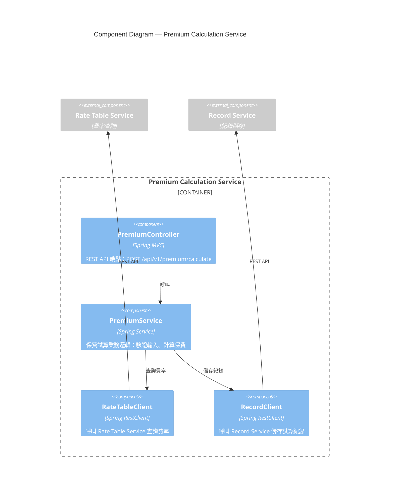
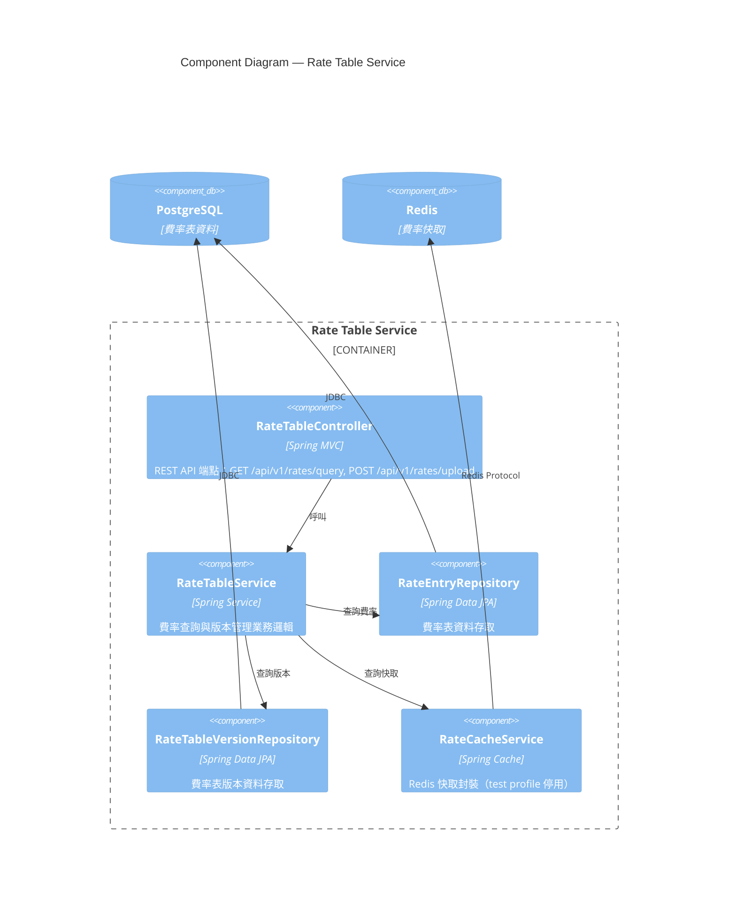
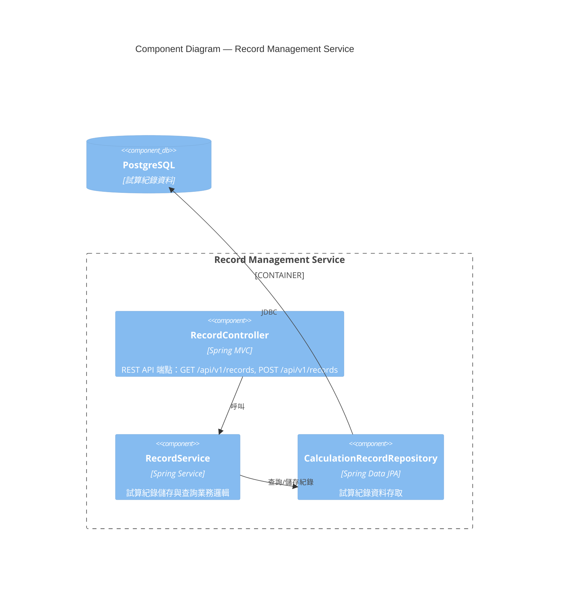
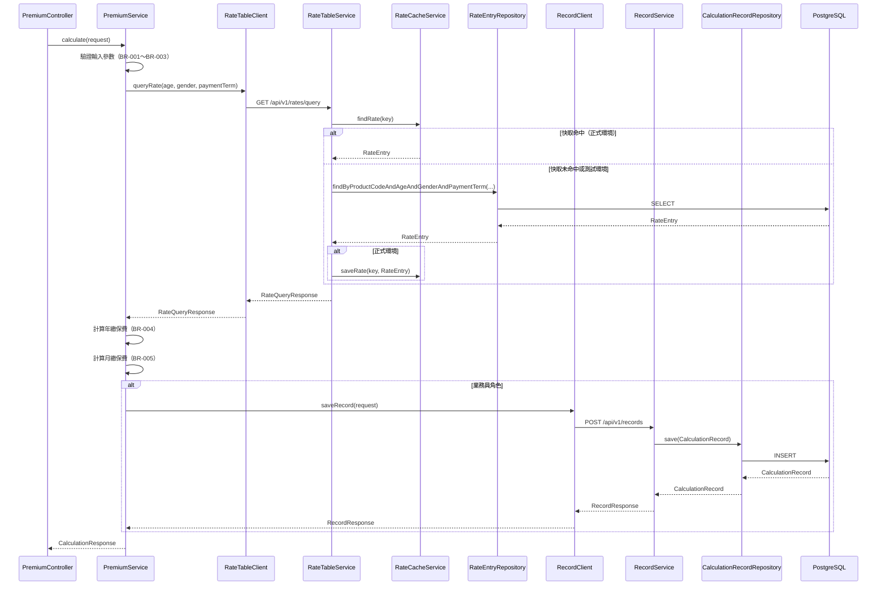
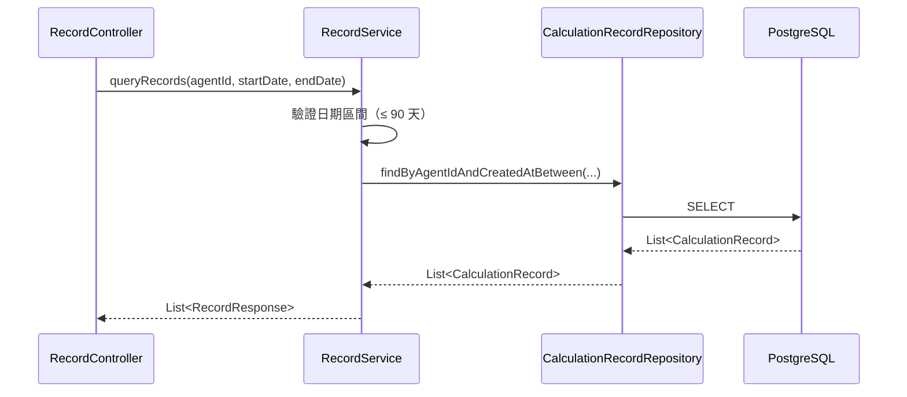
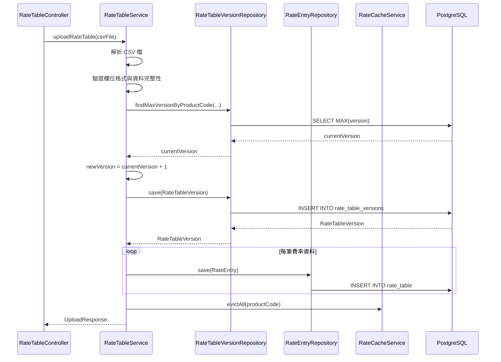
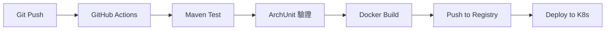

以下為 SD 文件:

# 系統設計文件 (System Design Document)

**文件編號：** SD-LIFE-v1.0　**專案名稱：** 壽險新保件保費試算系統 (Life Premium Calculator)
**版本：** v1.0　**建立日期：** 2026-09-14　**對應 FSD：** FSD-LIFE-v1.0

---

## 1. 文件目的
本文件描述壽險新保件保費試算系統的技術實作設計，作為開發團隊產出程式碼的直接依據。

## 2. 參考文件

| 文件名稱 | 版本 |
|----------|------|
| FSD-LIFE-v1.0 | v1.0 |
| ADR-0001-架構風格 | Accepted |
| ADR-0002-後端框架 | Accepted |
| ADR-0003-資料庫選型 | Accepted |
| ADR-0004-費率快取策略 | Accepted |
| ADR-0005-主鍵產生策略 | Accepted |
| ADR-0006-測試資料庫替代方案 | Accepted |

## 3. 架構概觀

### 3.1 架構風格
採用 **Modular Monolith**（模組化單體）架構，單一 Spring Boot 部署單元內以 package 劃分模組邊界：
- `premium` — 保費試算模組
- `rate` — 費率表管理模組
- `record` — 試算紀錄管理模組

模組間依賴規則由 ArchUnit 強制執行（依 ADR-0001）。

### 3.2 技術標準宣告

| 項目 | 值 |
|------|-----|
| **Package Root** | `com.example.lifepremium` |
| Java 版本 | 17 |
| Spring Boot 版本 | 3.3 |
| 資料庫（正式環境） | PostgreSQL 15 |
| 資料庫（測試環境） | H2 In-Memory (PostgreSQL Mode) |
| 快取（正式環境） | Redis 7 |
| 快取（測試環境） | 停用（直接查詢 Repository） |
| ORM | Spring Data JPA |
| API 文件 | Springdoc OpenAPI |

### 3.3 ADR 索引

| ADR | 決策主題 | 狀態 |
|-----|---------|------|
| [ADR-0001](../../adr/output/ADR-0001-架構風格.md) | 架構風格 | Accepted |
| [ADR-0002](../../adr/output/ADR-0002-後端框架.md) | 後端框架 | Accepted |
| [ADR-0003](../../adr/output/ADR-0003-資料庫選型.md) | 資料庫選型 | Accepted |
| [ADR-0004](../../adr/output/ADR-0004-費率快取策略.md) | 費率快取策略 | Accepted |
| [ADR-0005](../../adr/output/ADR-0005-主鍵產生策略.md) | 主鍵產生策略 | Accepted |
| [ADR-0006](../../adr/output/ADR-0006-測試資料庫替代方案.md) | 測試環境資料庫替代方案 | Accepted |

---

## 4. C4 L3 元件圖

### 4.1 Premium Calculation Service 元件圖



### 4.2 Rate Table Service 元件圖



### 4.3 Record Management Service 元件圖



---

## 5. 技術層循序圖

### 5.1 保費試算流程（對應 FR-PREMIUM-001）



### 5.2 試算紀錄查詢流程（對應 FR-RECORD-001）



### 5.3 費率表上傳流程（對應 FR-RATE-001）



---

## 6. 模組設計

| 模組 | Package | 依賴 | 對應 FR |
|------|---------|------|--------|
| Premium Calculation | `com.example.lifepremium.premium` | Rate Table, Record | FR-PREMIUM-001, FR-PREMIUM-002 |
| Rate Table | `com.example.lifepremium.rate` | 無 | FR-RATE-001, FR-RATE-002 |
| Record Management | `com.example.lifepremium.record` | 無 | FR-RECORD-001, FR-RECORD-002 |
| Common | `com.example.lifepremium.common` | 無 | 共用 DTO、Exception、Util |

**模組依賴規則（ArchUnit 強制執行）：**
- `premium` 可依賴 `rate`、`record`、`common`
- `rate` 僅可依賴 `common`
- `record` 僅可依賴 `common`
- 禁止循環依賴

---

## 7. 資料設計

### 7.1 ER 概述
系統包含四個主要實體：
- **Product**：商品主檔（本版本僅 LIFE-WL-01）
- **RateTableVersion**：費率表版本管理
- **RateEntry**：費率明細（每千元保額費率）
- **CalculationRecord**：試算紀錄

關聯：
- `RateTableVersion` 1:N `RateEntry`
- `CalculationRecord` 參照 `RateTableVersion`（透過 version 欄位）

### 7.2 資料表定義

#### Product（商品主檔）

| 欄位 | 型別 | 約束 | 說明 |
|------|------|------|------|
| id | UUID | PK | 主鍵 |
| product_code | VARCHAR(20) | UNIQUE, NOT NULL | 商品代碼（例：LIFE-WL-01） |
| product_name | VARCHAR(100) | NOT NULL | 商品名稱 |
| is_active | BOOLEAN | NOT NULL, DEFAULT TRUE | 是否啟用 |
| created_at | TIMESTAMP | NOT NULL | 建立時間 |
| updated_at | TIMESTAMP | NOT NULL | 更新時間 |

**索引：** `idx_product_code` (product_code)
**快取策略：** 無（商品資料變動極少，直接查詢）

#### RateTableVersion（費率表版本）

| 欄位 | 型別 | 約束 | 說明 |
|------|------|------|------|
| id | UUID | PK | 主鍵 |
| product_code | VARCHAR(20) | NOT NULL | 商品代碼 |
| version | INT | NOT NULL | 版本號（1, 2, 3, ...） |
| upload_time | TIMESTAMP | NOT NULL | 上傳時間 |
| uploaded_by | VARCHAR(50) | NOT NULL | 上傳者（管理員 ID） |
| is_active | BOOLEAN | NOT NULL, DEFAULT TRUE | 是否為最新版本 |

**複合唯一約束：** `UNIQUE(product_code, version)`
**索引：** `idx_product_version` (product_code, version)
**快取策略：** 無（版本查詢頻率低）

#### RateEntry（費率明細）

| 欄位 | 型別 | 約束 | 說明 |
|------|------|------|------|
| id | UUID | PK | 主鍵 |
| rate_table_version_id | UUID | FK, NOT NULL | 費率表版本 ID |
| product_code | VARCHAR(20) | NOT NULL | 商品代碼 |
| age | INT | NOT NULL, CHECK (age >= 0 AND age <= 70) | 被保人年齡 |
| gender | CHAR(1) | NOT NULL, CHECK (gender IN ('M', 'F')) | 性別 |
| payment_term | INT | NOT NULL, CHECK (payment_term IN (10, 20, 30, 99)) | 繳費年期 |
| rate | DECIMAL(10, 2) | NOT NULL, CHECK (rate > 0) | 每千元保額費率 |

**複合唯一約束：** `UNIQUE(rate_table_version_id, age, gender, payment_term)`
**索引：** 
- `idx_rate_lookup` (product_code, age, gender, payment_term, rate_table_version_id)
- `idx_rate_version` (rate_table_version_id)

**快取策略：** Redis Cache-Aside，Key: `rate:{productCode}:{version}:{age}:{gender}:{paymentTerm}`，TTL=1hr（正式環境）；測試環境停用快取

#### CalculationRecord（試算紀錄）

| 欄位 | 型別 | 約束 | 說明 |
|------|------|------|------|
| id | UUID | PK | 主鍵 |
| agent_id | VARCHAR(50) | NOT NULL | 業務員 ID（訪客為 'GUEST'） |
| created_at | TIMESTAMP | NOT NULL | 試算時間 |
| product_code | VARCHAR(20) | NOT NULL | 商品代碼 |
| age | INT | NOT NULL | 被保人年齡 |
| gender | CHAR(1) | NOT NULL | 性別 |
| coverage_amount | BIGINT | NOT NULL | 保額（單位：元） |
| payment_term | INT | NOT NULL | 繳費年期 |
| annual_premium | BIGINT | NOT NULL | 年繳保費（單位：元） |
| monthly_premium | BIGINT | NOT NULL | 月繳保費（單位：元） |
| rate | DECIMAL(10, 2) | NOT NULL | 使用的費率 |
| rate_version | INT | NOT NULL | 費率表版本 |

**索引：** 
- `idx_agent_created` (agent_id, created_at DESC)
- `idx_created_at` (created_at)

**快取策略：** 無（試算紀錄為寫入密集型資料，不快取）

---

## 8. API 設計

### 8.1 API 清單

| Method | Path | 說明 | 權限 | 對應 FR |
|--------|------|------|------|--------|
| POST | /api/v1/premium/calculate | 保費試算 | Agent / Guest | FR-PREMIUM-001 |
| GET | /api/v1/rates/query | 費率查詢（內部 API） | Internal | FR-PREMIUM-002 |
| POST | /api/v1/rates/upload | 費率表上傳 | Admin | FR-RATE-001 |
| GET | /api/v1/records | 試算紀錄查詢 | Agent | FR-RECORD-001 |
| GET | /api/v1/records/{id} | 單筆試算紀錄查詢 | Agent | FR-RECORD-001 |
| POST | /api/v1/records | 試算紀錄儲存（內部 API） | Internal | FR-RECORD-002 |

### 8.2 Request/Response Schema

#### POST /api/v1/premium/calculate

**Request Body：**
```json
{
  "age": 35,
  "gender": "M",
  "coverageAmount": 10000000,
  "paymentTerm": 20
}
```

**Validation：**
- `age`: 整數，範圍 0～70
- `gender`: 枚舉 {"M", "F"}
- `coverageAmount`: 整數，範圍 1,000,000～50,000,000（單位：元）
- `paymentTerm`: 枚舉 {10, 20, 30, 99}

**Response Body（成功）：**
```json
{
  "success": true,
  "data": {
    "annualPremium": 125000,
    "monthlyPremium": 10729,
    "rate": 12.50,
    "rateVersion": 1,
    "recordId": "550e8400-e29b-41d4-a716-446655440000"
  },
  "message": null,
  "timestamp": "2026-09-14T10:30:00Z"
}
```

**Response Body（錯誤）：**
```json
{
  "success": false,
  "data": null,
  "message": "被保人年齡須介於 0～70 歲",
  "timestamp": "2026-09-14T10:30:00Z"
}
```

#### GET /api/v1/rates/query

**Query Parameters：**
- `productCode`: 商品代碼（預設 LIFE-WL-01）
- `age`: 年齡
- `gender`: 性別
- `paymentTerm`: 繳費年期
- `version`: 費率版本（選填，預設最新版本）

**Response Body：**
```json
{
  "success": true,
  "data": {
    "rate": 12.50,
    "version": 1
  },
  "message": null,
  "timestamp": "2026-09-14T10:30:00Z"
}
```

#### GET /api/v1/records

**Query Parameters：**
- `agentId`: 業務員 ID（從 JWT Token 取得）
- `startDate`: 起始日期（ISO 8601 格式）
- `endDate`: 結束日期（ISO 8601 格式）

**Response Body：**
```json
{
  "success": true,
  "data": [
    {
      "id": "550e8400-e29b-41d4-a716-446655440000",
      "createdAt": "2026-09-01T10:00:00Z",
      "age": 35,
      "gender": "M",
      "coverageAmount": 10000000,
      "paymentTerm": 20,
      "annualPremium": 125000,
      "monthlyPremium": 10729,
      "rate": 12.50,
      "rateVersion": 1
    }
  ],
  "message": null,
  "timestamp": "2026-09-14T10:30:00Z"
}
```

#### POST /api/v1/rates/upload

**Request Body（multipart/form-data）：**
- `file`: CSV 檔案

**CSV 格式：**
```csv
product_code,age,gender,payment_term,rate
LIFE-WL-01,35,M,20,12.50
LIFE-WL-01,35,F,20,11.20
```

**Response Body：**
```json
{
  "success": true,
  "data": {
    "version": 2,
    "uploadedRecords": 284
  },
  "message": "費率表上傳成功",
  "timestamp": "2026-09-14T10:30:00Z"
}
```

### 8.3 錯誤碼表

| HTTP 狀態碼 | 錯誤碼 | 說明 | 觸發情境 |
|------------|--------|------|---------|
| 400 | VALIDATION_ERROR | 欄位驗證失敗 | 輸入參數格式錯誤 |
| 401 | UNAUTHORIZED | 未授權 | 未登入或 Token 無效 |
| 403 | FORBIDDEN | 禁止存取 | 權限不足 |
| 404 | RESOURCE_NOT_FOUND | 資源不存在 | 查詢紀錄 ID 不存在 |
| 422 | BUSINESS_RULE_VIOLATION | 業務規則驗證失敗 | 年齡超出範圍、查無對應費率 |
| 500 | INTERNAL_SERVER_ERROR | 伺服器內部錯誤 | 資料庫連線失敗、未預期例外 |

---

## 9. 安全設計

### 9.1 認證方式
- **業務員與管理員**：JWT Token（由外部身份驗證系統核發）
- **訪客**：允許匿名存取 `/api/v1/premium/calculate`

### 9.2 授權矩陣

| API | Agent | Guest | Admin |
|-----|-------|-------|-------|
| POST /api/v1/premium/calculate | ✓ | ✓ | ✓ |
| GET /api/v1/records | ✓ | ✗ | ✓ |
| POST /api/v1/rates/upload | ✗ | ✗ | ✓ |
| GET /api/v1/rates/query | Internal | Internal | Internal |

### 9.3 安全機制
- **TLS 1.2+**：所有 API 強制 HTTPS
- **Rate Limiting**：每 IP 每分鐘最多 60 次請求（Spring Cloud Gateway 實作）
- **CORS**：僅允許公司內部網域與官網網域
- **SQL Injection 防護**：使用 JPA Prepared Statement
- **XSS 防護**：API 回應 Header 加入 `X-Content-Type-Options: nosniff`

---

## 10. 部署架構

### 10.1 環境清單

| 環境 | 用途 | 資料庫 | 快取 |
|------|------|--------|------|
| dev | 開發環境 | H2 In-Memory | 停用 |
| test | 測試環境 | H2 In-Memory | 停用 |
| local | 本機整合測試 | PostgreSQL (Docker) | Redis (Docker) |
| prod | 正式環境 | PostgreSQL 15 | Redis 7 |

### 10.2 容器化
- **Docker Image**：基於 `eclipse-temurin:17-jre-alpine`
- **Dockerfile 多階段建置**：Maven 編譯 → 精簡 Runtime Image

### 10.3 CI/CD 流程


---

## 11. 可觀測性

### 11.1 監控指標
- **應用層**：Spring Boot Actuator `/actuator/metrics`
- **JVM**：Heap/Non-Heap Memory、GC 次數與時間
- **API**：回應時間（P50/P95/P99）、錯誤率
- **資料庫**：連線池使用率、查詢回應時間
- **快取**：命中率、失效次數

### 11.2 日誌規範
- **格式**：JSON（含 traceId、spanId、timestamp、level、message）
- **等級**：ERROR（例外）、WARN（業務規則驗證失敗）、INFO（API 呼叫）、DEBUG（內部邏輯）
- **保留期限**：90 天

### 11.3 健康檢查
- **端點**：`/actuator/health`
- **檢查項目**：資料庫連線、Redis 連線（正式環境）

---

## 12. 效能與快取策略

### 12.1 效能目標
- API 回應時間（P95）：≤ 500ms
- 費率查詢（快取命中）：≤ 50ms
- 費率查詢（快取未命中）：≤ 200ms

### 12.2 快取策略（依 ADR-0004）
- **正式環境**：Redis Cache-Aside，TTL=1hr
- **測試環境**：停用快取（依 ADR-0006）
- **快取 Key 格式**：`rate:{productCode}:{version}:{age}:{gender}:{paymentTerm}`
- **失效策略**：費率表上傳時清除該商品所有快取

### 12.3 資料庫最佳化
- **索引**：依查詢頻率建立複合索引（見 §7.2）
- **連線池**：HikariCP，最大連線數 20
- **查詢最佳化**：避免 N+1 查詢，使用 `@EntityGraph` 或 JOIN FETCH

---

## 13. 錯誤處理策略

### 13.1 統一例外處理
所有例外由 `GlobalExceptionHandler`（`@RestControllerAdvice`）攔截，回傳標準 `ApiResponse` 格式：

```java
@RestControllerAdvice
public class GlobalExceptionHandler {
    
    @ExceptionHandler(BusinessRuleViolationException.class)
    public ResponseEntity<ApiResponse<Void>> handleBusinessRuleViolation(BusinessRuleViolationException ex) {
        return ResponseEntity.status(HttpStatus.UNPROCESSABLE_ENTITY)
            .body(ApiResponse.error(ex.getMessage()));
    }
    
    @ExceptionHandler(ResourceNotFoundException.class)
    public ResponseEntity<ApiResponse<Void>> handleResourceNotFound(ResourceNotFoundException ex) {
        return ResponseEntity.status(HttpStatus.NOT_FOUND)
            .body(ApiResponse.error(ex.getMessage()));
    }
    
    @ExceptionHandler(Exception.class)
    public ResponseEntity<ApiResponse<Void>> handleGenericException(Exception ex) {
        log.error("Unexpected error", ex);
        return ResponseEntity.status(HttpStatus.INTERNAL_SERVER_ERROR)
            .body(ApiResponse.error("系統錯誤，請稍後再試"));
    }
}
```

### 13.2 業務規則驗證例外
- **BR-001～BR-003 驗證失敗**：拋出 `BusinessRuleViolationException`，回傳 422
- **查無對應費率**：拋出 `RateNotFoundException`（繼承 `BusinessRuleViolationException`），回傳 422

### 13.3 降級策略
- **Redis 故障**：降級至直接查詢資料庫（效能降低但不影響功能）
- **Record Service 故障**：試算結果仍回傳，但不儲存紀錄（記錄錯誤日誌）

---

*本文件由 GitHub Copilot `generate-sd` Skill 產生，依 FSD-LIFE-v1.0 與既有 Accepted ADR（ADR-0001～ADR-0006）為基礎。*